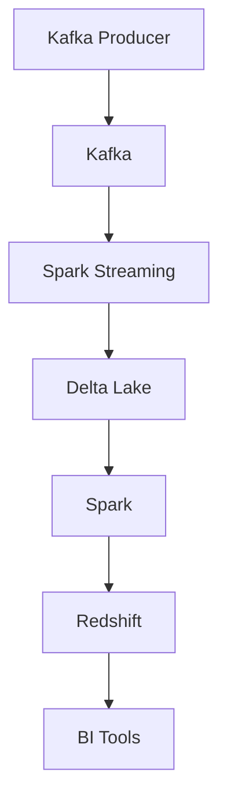
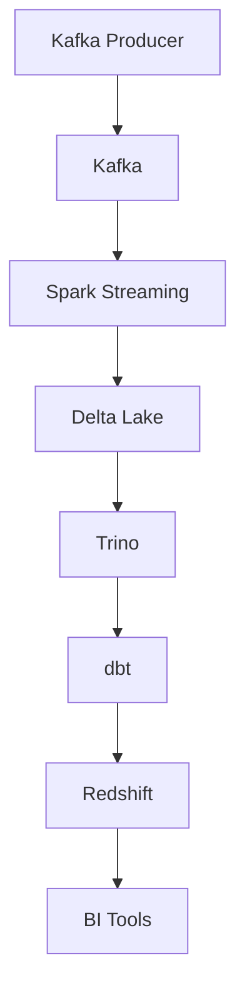
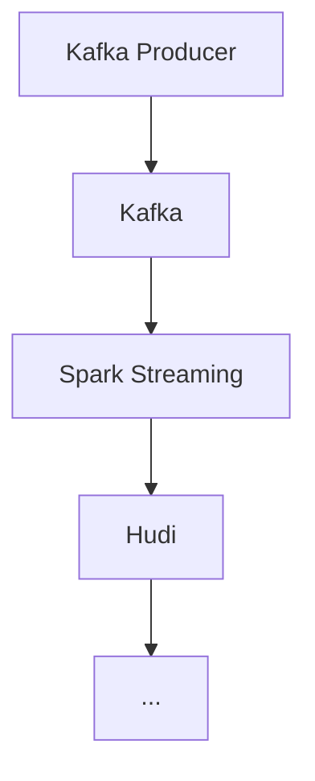

# Scalable Clickstream Data Pipeline for User Behavior Analytics

A production-grade data pipeline for processing and analyzing user clickstream data at scale.

## 🏗️ Architecture

### Delta Lake + Spark




### Delta Lake + Trino + dbt




### Hudi instead of Delta Lake




## 🛠️ Tech Stack

- **Apache Kafka**: Real-time event ingestion
- **Apache Spark Structured Streaming**: Stream processing
- **Delta Lake & Apache Hudi**: Dual-format data lake storage
- **Hive Metastore + Trino**: SQL-based query engine and catalog
- **Airflow**: Pipeline orchestration
- **dbt**: Data quality validation and schema checks
- **Redshift**: Downstream BI integration
- **Terraform**: AWS infrastructure provisioning

## 📁 Project Structure

```
.
├── terraform/                 # Infrastructure as Code
│   ├── modules/              # Reusable Terraform modules
│   └── environments/         # Environment-specific configurations
├── src/                      # Source code
│   ├── producer/            # Kafka producer
│   ├── streaming/           # Spark streaming jobs
│   └── batch/              # Batch processing jobs
├── dbt/                      # Data transformation
│   ├── models/             # dbt models
│   ├── tests/              # Data quality tests
│   └── analyses/           # Ad-hoc analyses
├── airflow/                  # Pipeline orchestration
│   └── dags/               # Airflow DAGs
└── config/                  # Configuration files
```

## 🚀 Getting Started

### Prerequisites

- AWS Account with appropriate permissions
- Terraform v1.0+
- Python 3.8+
- Apache Spark 3.3+
- Apache Kafka 2.8+
- dbt 1.0+
- Airflow 2.0+

### Infrastructure Setup

1. Initialize Terraform:

```bash
cd terraform/environments/dev
terraform init
```

1. Apply infrastructure:

```bash
terraform apply
```

### Running the Pipeline

1. Start Kafka:

```bash
./scripts/start_kafka.sh
```

1. Start the producer:

```bash
python src/producer/producer.py
```

1. Start Spark streaming:

```bash
spark-submit src/streaming/streaming_job.py
```

1. Run batch processing:

```bash
spark-submit src/batch/batch_job.py
```

1. Run dbt tests:

```bash
cd dbt
dbt test
```

## 📊 Data Flow

1. **Ingestion**: Kafka producer generates synthetic clickstream events
2. **Processing**: Spark streaming job processes events in real-time
3. **Storage**: Data is stored in both Delta Lake and Hudi formats
4. **Transformation**: dbt models transform and validate the data
5. **Analytics**: Trino provides SQL access for analytics
6. **BI**: Aggregated data is synced to Redshift for BI tools

## 🔍 Data Quality

- Schema validation
- Data completeness checks
- Duplicate detection
- Anomaly detection
- Freshness monitoring

## 📈 Performance Tuning

### Kafka

- Optimize partition count based on throughput
- Configure appropriate retention policies
- Monitor consumer lag

### Spark

- Tune executor memory and cores
- Optimize shuffle partitions
- Configure appropriate batch intervals

### Delta Lake

- Regular compaction
- Z-ordering for query performance
- Vacuum old files

### Hudi

- Configure appropriate compaction strategy
- Optimize upsert performance
- Manage file sizes

## 🛠️ Monitoring

- Airflow task status and logs
- Spark UI for job monitoring
- Kafka metrics
- dbt test results
- Data quality dashboards

## 🤝 Contributing

1. Fork the repository
2. Create a feature branch
3. Commit your changes
4. Push to the branch
5. Create a Pull Request

## 📝 License

This project is licensed under the MIT License - see the [LICENSE](LICENSE) file for details.

## 📞 Support

For support, please open an issue in the GitHub repository or contact the maintainers. 