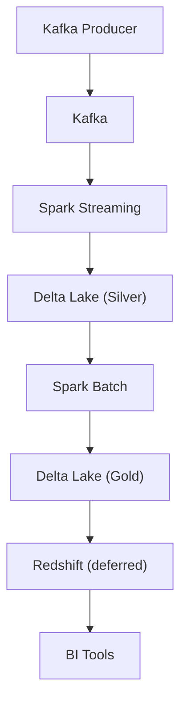
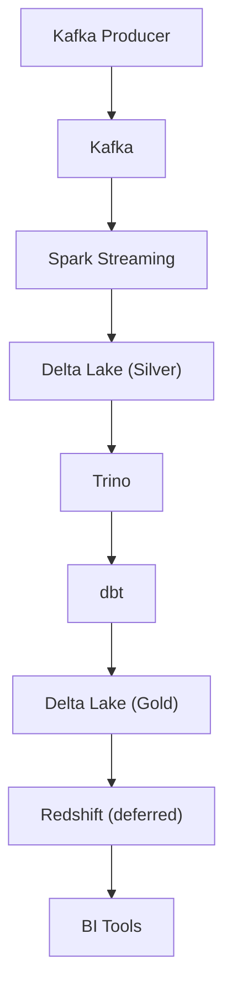
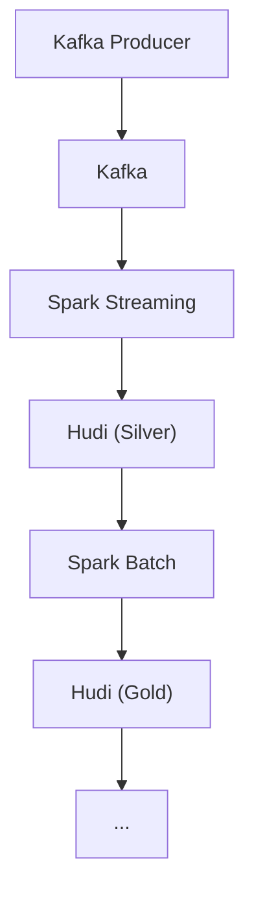
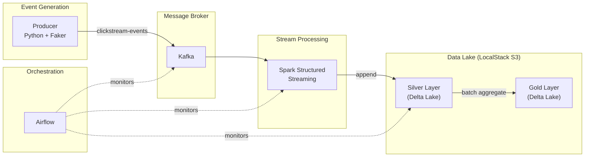
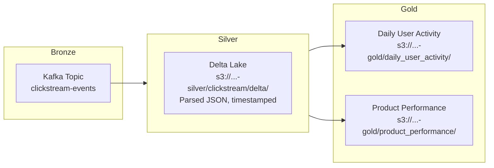
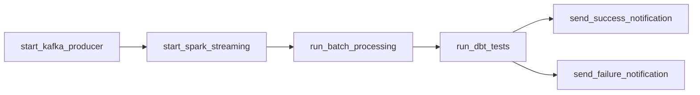
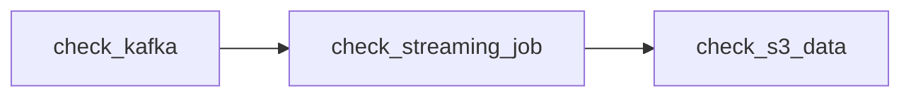

# Scalable Clickstream Data Pipeline for User Behavior Analytics

A Dockerized data pipeline for processing and analyzing user clickstream data at scale, designed as a hands-on learning environment for Modern Data Architecture patterns.

## Architecture

This project supports multiple architecture scenarios. **Scenario 1** is fully implemented; the others are on the [roadmap](docs/roadmap.md).

### Scenario 1: Delta Lake + Spark (current)




### Scenario 2: Delta Lake + Trino + dbt




### Scenario 3: Hudi instead of Delta Lake




> Scenarios 2 and 3 are not yet implemented. See the [roadmap](docs/roadmap.md) for details and implementation priority.

## End-to-End Data Flow




## Medallion Architecture




## Tech Stack


| Component         | Technology                        | Purpose                             |
| ----------------- | --------------------------------- | ----------------------------------- |
| Event Producer    | Python, Faker, kafka-python       | Synthetic clickstream generation    |
| Message Broker    | Apache Kafka + Zookeeper          | Real-time event ingestion           |
| Stream Processing | Apache Spark Structured Streaming | Kafka-to-Delta Lake streaming       |
| Storage Format    | Delta Lake 3.2                    | ACID transactions, time travel      |
| Object Storage    | LocalStack S3                     | Local AWS S3 emulation              |
| Batch Processing  | Apache Spark                      | Silver-to-Gold aggregation          |
| Orchestration     | Apache Airflow 3.2                | Pipeline and health monitoring DAGs |
| SQL Query Engine  | Trino 380                         | Interactive SQL (deferred)          |
| Kafka Web UI      | Kafdrop                           | Topic inspection and monitoring     |
| Database          | PostgreSQL 13                     | Airflow metadata                    |


## Web UIs


| Service      | URL                                            | Credentials   |
| ------------ | ---------------------------------------------- | ------------- |
| Spark Master | [http://localhost:8080](http://localhost:8080) | —             |
| Airflow      | [http://localhost:8081](http://localhost:8081) | No login required |
| Trino        | [http://localhost:8082](http://localhost:8082) | —             |
| Kafdrop      | [http://localhost:9033](http://localhost:9033) | —             |


## Project Structure

```
.
├── dags/                         # Airflow DAGs
│   ├── pipeline_dag.py           #   Clickstream pipeline (demo)
│   └── pipeline_health_dag.py    #   Infrastructure health monitor
├── src/                          # Application source code
│   ├── producer/                 #   Kafka event producer
│   ├── streaming/                #   Spark Structured Streaming job
│   └── batch/                    #   Spark batch aggregation job
├── docker/                       # Custom Dockerfiles
│   └── producer/                 #   Producer container image
├── scripts/                      # Initialization scripts
│   ├── kafka-init/               #   Kafka topic creation
│   └── localstack-init/          #   S3 bucket creation
├── config/                       # Service configurations
│   └── trino/                    #   Trino server config
├── dbt/                          # Data transformation (deferred)
├── docs/                         # Documentation
│   └── roadmap.md                #   Deferred items and future vision
├── docker-compose.yml            # All services definition
└── env.sample                    # Environment variable reference
```

## Prerequisites

- [Docker](https://docs.docker.com/get-docker/) and Docker Compose v2
- 8 GB+ RAM allocated to Docker (services are resource-intensive)
- **Note for Apple Silicon Macs:** Confluent images (Kafka, Zookeeper) run under amd64 emulation via QEMU. Initial startup may take 2-3 minutes.

## Running the Pipeline

### 1. Start all services

```bash
docker compose up -d
```

This starts 12 containers: Zookeeper, Kafka, kafka-init, Kafdrop, Spark Master, Spark Worker, streaming-job, producer, Airflow, PostgreSQL, Trino, and LocalStack.

Wait for all healthchecks to pass (1-3 minutes depending on hardware):

```bash
docker compose ps
```

All services should show `Up` (with `healthy` where applicable).

### 2. Verify data is flowing

Check that the producer is generating events:

```bash
docker compose logs producer --tail 5
```

Check that the streaming job is processing micro-batches:

```bash
docker compose logs streaming-job --tail 10
```

Check that Delta Lake data has landed in S3:

```bash
docker exec user-behavior-analytics-localstack-1 awslocal s3 ls s3://user-behavior-analytics-silver/clickstream/delta/ --recursive
```

### 3. Explore the Web UIs

- **Kafdrop** ([http://localhost:9033](http://localhost:9033)): View the `clickstream-events` topic, browse messages, check partition offsets
- **Spark Master** ([http://localhost:8080](http://localhost:8080)): See the `ClickstreamStreaming` application running, worker status, and executor details
- **Airflow** ([http://localhost:8081](http://localhost:8081)): No login required — trigger the `clickstream_pipeline` DAG manually, and check the `pipeline_health_monitor` DAG

### 4. Run batch aggregation (Silver to Gold)

```bash
docker exec user-behavior-analytics-spark-master-1 \
  /opt/spark/bin/spark-submit \
    --master spark://spark-master:7077 \
    --conf spark.driver.extraJavaOptions=-Divy.home=/tmp/ivy2 \
    --packages io.delta:delta-spark_2.12:3.2.0,org.apache.hadoop:hadoop-aws:3.3.4,com.amazonaws:aws-java-sdk-bundle:1.12.262 \
    /opt/spark/app/src/batch/batch_job.py
```

Verify Gold layer data:

```bash
docker exec user-behavior-analytics-localstack-1 awslocal s3 ls s3://user-behavior-analytics-gold/ --recursive
```

### 5. Stop everything

```bash
docker compose down       # Stop and remove containers (keep volumes)
docker compose down -v    # Stop, remove containers AND volumes (clean slate)
```

## Airflow DAGs

### clickstream_pipeline (daily, paused at creation)



Orchestrates the full data pipeline using BashOperator tasks. Runs the Kafka producer (60 s burst), Spark Structured Streaming, Spark batch aggregation, and dbt tests in sequence. On completion, sends a success or failure email notification. Scheduled daily at midnight but paused at creation — unpause from the Airflow UI to enable, or trigger manually.

### pipeline_health_monitor (every 5 min)




Monitors the running infrastructure: verifies Kafka topics exist (via Kafdrop API), checks for active Spark streaming applications (via Spark Master REST API), and confirms Delta Lake data is present in S3.

## Data Flow Summary

1. **Ingestion**: Python producer generates synthetic clickstream events (page views, product views, cart additions, checkouts, purchases)
2. **Streaming**: Spark Structured Streaming consumes from Kafka, parses JSON, adds a processing timestamp, and writes to Delta Lake Silver layer on S3
3. **Batch Aggregation**: On-demand Spark batch job reads Silver, creates daily user activity and product performance aggregations, writes to Delta Lake Gold layer
4. **Monitoring**: Airflow health DAG continuously checks Kafka, Spark, and S3 status; pipeline DAG demonstrates orchestrated batch processing

## Deferred Features

See [docs/roadmap.md](docs/roadmap.md) for the full roadmap. Key items not yet implemented:

- Redshift sync (Gold -> Redshift via JDBC)
- Trino catalog configuration and SQL analytics
- dbt data quality and transformation models
- Hudi storage format (Scenario 3)
- Docker Compose profiles for selective scenario startup
- Custom Airflow image with Spark and dbt

## License

This project is licensed under the MIT License - see the [LICENSE](LICENSE) file for details.