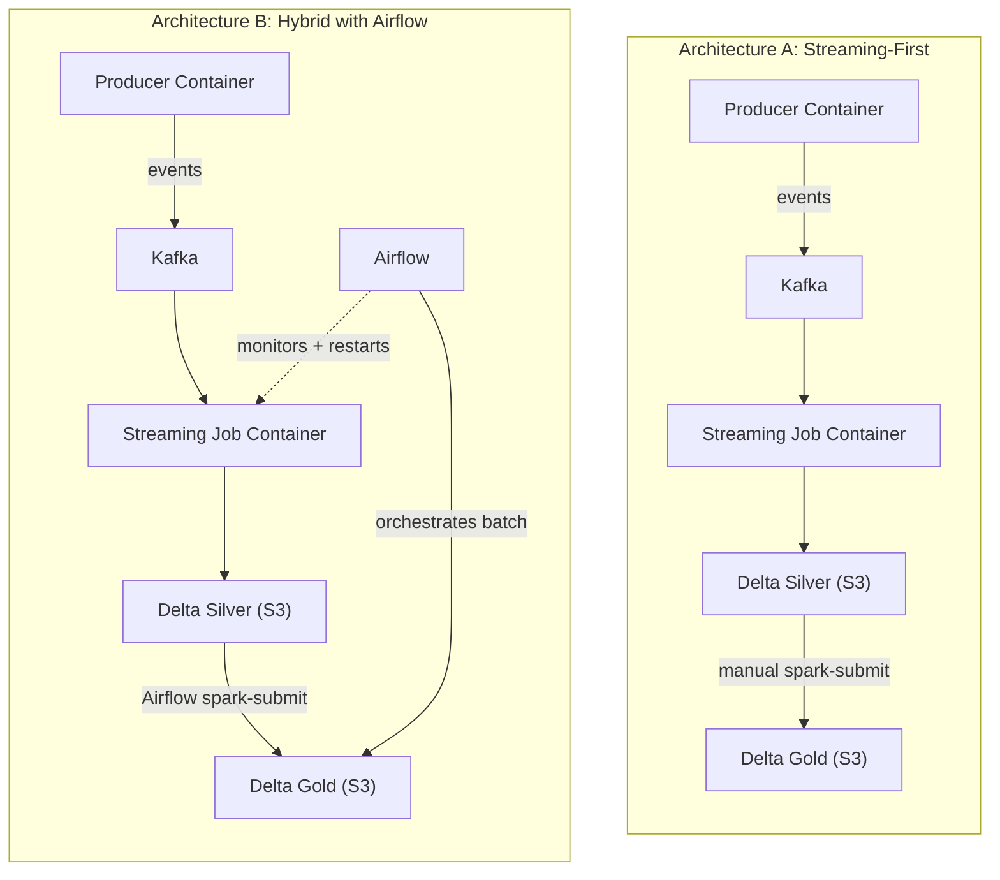
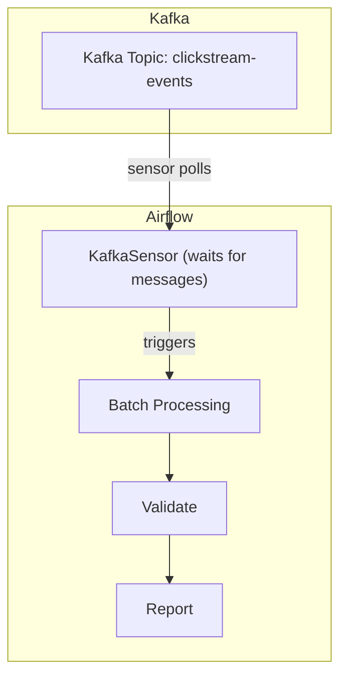
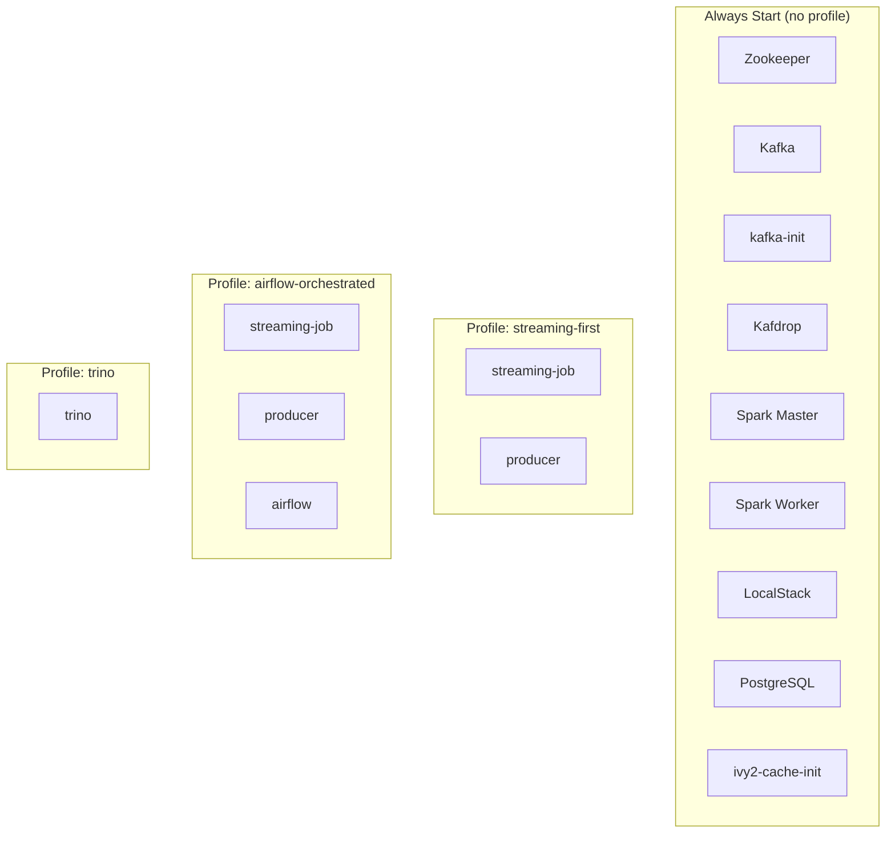

# Architecture Guide

This project is designed as a **Data Architecture Playground** where different orchestration and processing patterns can be explored, compared, and composed. This guide documents the available architectures, explains what is currently implemented, and describes how to configure the solution for each pattern.

---

## Current State

Two orchestration architectures are runnable today via Docker Compose profiles:

- **Architecture A (Streaming-First)** — `docker compose --profile streaming-first up -d`
- **Architecture B (Hybrid with Airflow)** — `docker compose --profile airflow-orchestrated up -d`

Both architectures share the same data pipeline containers (`producer`, `streaming-job`). The only difference is whether Airflow runs alongside them to supervise streaming and orchestrate batch.

```
Producer (Python)  →  Kafka  →  Spark Structured Streaming  →  Delta Lake Silver (S3)
                                                                      │
                                                               Spark Batch
                                                                      │
                                                               Delta Lake Gold (S3)
```

In Architecture A the batch step is triggered manually. In Architecture B, Airflow triggers it and also supervises the streaming container. Two more architectures (full Airflow submission, event-driven) are documented below for comparison but are not runnable on the current Spark Standalone cluster.

---

## Architecture A vs B — what changes

This is the canonical side-by-side view of the two runnable architectures. Individual architecture sections below only add details that are specific to that architecture.




---

## Orchestration Architectures

### Architecture A: Streaming-First

**How it works:**

- The streaming job runs as a long-lived Docker container (`streaming-job` service) and starts automatically with the profile.
- Batch aggregation (Silver → Gold) is triggered manually via `docker exec`.
- No Airflow is running; health checks are performed by the user on demand.

**When to use this pattern:**

- Real-time data must be processed with minimal latency.
- The streaming job should survive orchestration-layer outages.
- This is how Netflix, Uber, and LinkedIn run their streaming workloads.

**Trade-offs:**


| Advantage                           | Disadvantage                                              |
| ----------------------------------- | --------------------------------------------------------- |
| Simplest to set up                  | No centralized orchestration                              |
| Low latency                         | Batch jobs must be triggered manually                     |
| Streaming survives Airflow downtime | Less visibility into pipeline health from a single UI     |
| No custom Airflow image needed      | Streaming job restart requires manual Docker intervention |


**Configuration:** `docker compose --profile streaming-first up -d`.

---

### Architecture B: Hybrid with Airflow

This is what the industry commonly calls the "recommended for production" pattern: keep the streaming layer self-managed, let Airflow own batch and be a supervisor for streaming.

**How it works:**

- The streaming job still runs as a long-lived Docker container (same `streaming-job` service as Architecture A).
- `clickstream_streaming_supervisor` DAG (every 5 minutes) queries the Spark Master REST API. If the streaming application is missing, it calls the Docker Engine API through the bind-mounted `/var/run/docker.sock` and restarts the container.
- `clickstream_batch` DAG (manual trigger or cron) runs `spark-submit` from within Airflow to aggregate Silver → Gold, then verifies the Gold-layer objects in S3.
- `pipeline_health_monitor` DAG continues to watch Kafka and S3 (Spark streaming health moved to the supervisor DAG to avoid duplicate 5-minute checks).

**Why not submit everything from Airflow?** See "Architecture B-alt" below.

**When to use this pattern:**

- You want a single UI to view batch orchestration, task logs, and pipeline history.
- Streaming must be resilient to Airflow outages but should be restarted automatically when it dies.
- Team already treats Airflow as the standard orchestration tool.

**Trade-offs:**


| Advantage                                                | Disadvantage                                                  |
| -------------------------------------------------------- | ------------------------------------------------------------- |
| Centralized batch orchestration with task history        | Custom Airflow image (Java 17 + Spark 3.5.3) required         |
| Streaming survives Airflow outages                       | Docker socket must be bind-mounted into the Airflow container |
| Automatic streaming recovery via supervision DAG         | Two systems to monitor (Docker + Airflow)                     |
| `spark-submit` from Airflow reuses the shared ivy2 cache | —                                                             |


**Configuration:** `docker compose --profile airflow-orchestrated up -d`. See [infrastructure.md](infrastructure.md) for the custom image and DAG details.

---

### Architecture B-alt: Full Airflow Submission (not runnable on Spark Standalone)

A tempting alternative would be for Airflow to submit the streaming job itself via `spark-submit --deploy-mode cluster --supervise`, so the streaming task appears in Airflow's DAG graph. On **YARN** or **Kubernetes** this is the standard approach. On **Spark Standalone** (what this playground runs) it is simply not possible:

- PySpark applications are explicitly blocked from `--deploy-mode cluster` on the Standalone cluster manager: *"Cluster deploy mode is currently not supported for python applications on standalone clusters."* This limitation is permanent for Standalone.
- `--deploy-mode client` would run the driver inside the Airflow task, and `streaming_job.py` calls `awaitTermination()` — so the Airflow task would block forever and never mark the DAG run complete.

This is itself a teaching point: **the orchestration architecture you can pick is constrained by the cluster manager you have**. Running on YARN or Kubernetes would unlock this pattern; on Standalone, the Hybrid pattern (Architecture B) is what you get.

---

### Architecture D: Event-Driven (Kafka-Triggered)




**How it works:**

- An Airflow KafkaSensor watches the Kafka topic for new messages.
- When messages arrive (or a threshold is met), the DAG triggers downstream processing.
- No fixed schedule — processing is driven by data availability.

**When to use this pattern:**

- Processing should happen as soon as data is available.
- You want to avoid fixed schedules that waste resources or add latency.
- Useful for event-driven microservices and real-time analytics.

**Configuration:** Requires `apache-airflow-providers-apache-kafka` to be added to the custom Airflow image. **Not yet implemented** — see [roadmap.md](roadmap.md).

---

## Storage Format Architectures

Orthogonal to the orchestration pattern, the **storage format** can also be swapped.


| Scenario       | Storage Format | Query Engine        | Status      |
| -------------- | -------------- | ------------------- | ----------- |
| **Scenario 1** | Delta Lake     | Spark / `spark-sql` | **Working** |
| **Scenario 2** | Delta Lake     | Trino + dbt         | Deferred    |
| **Scenario 3** | Hudi           | Spark               | Deferred    |


These can be combined with any orchestration architecture above. For example:

- Architecture A + Scenario 1 = streaming-first with manual batch (default today)
- Architecture B + Scenario 1 = hybrid with Airflow-orchestrated batch (default today)
- Architecture B + Scenario 2 = hybrid pipeline with Trino-served Gold layer and dbt transformations

---

## How to Switch Architectures

Docker Compose profiles control which services come up. Core infrastructure (Kafka, Spark, LocalStack, Postgres, etc.) always starts; profile selection decides whether the data pipeline containers and/or Airflow also start.


| Architecture                | Command                                                                         |
| --------------------------- | ------------------------------------------------------------------------------- |
| **A (Streaming-First)**     | `docker compose --profile streaming-first up -d`                                |
| **B (Hybrid with Airflow)** | `docker compose --profile airflow-orchestrated up -d`                           |
| A + B simultaneously        | `docker compose --profile streaming-first --profile airflow-orchestrated up -d` |
| Core infrastructure only    | `docker compose up -d`                                                          |


Running both profiles together is safe: `streaming-job` and `producer` are defined under both profiles so Docker Compose only instantiates them once, and the supervisor DAG sees the healthy app and never triggers a restart.

### Profile-to-service mapping




---

## Related Documentation

- [infrastructure.md](infrastructure.md) — Service-by-service reference, including the custom Airflow image and the new DAGs.
- [data-flow.md](data-flow.md) — Medallion layers, write paths, and inspection commands.
- [troubleshooting.md](troubleshooting.md) — Common gotchas (ivy2-cache permissions, Docker socket on Linux hosts).
- [roadmap.md](roadmap.md) — Deferred items, implementation specs, and future vision.

