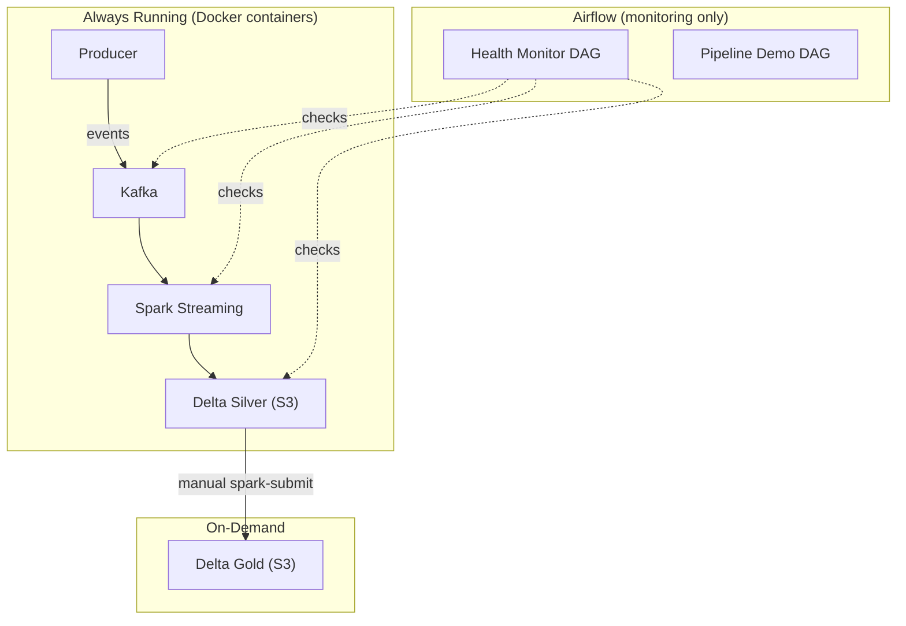
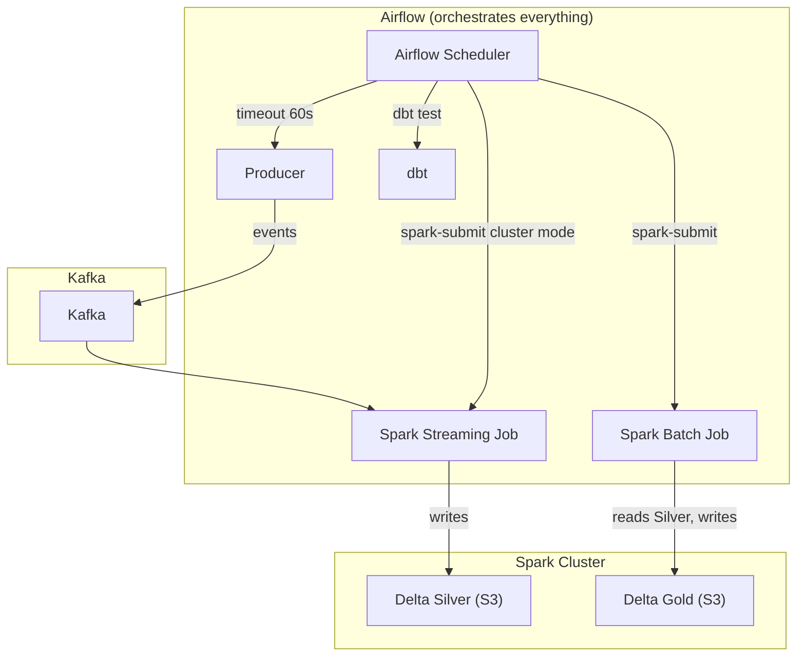
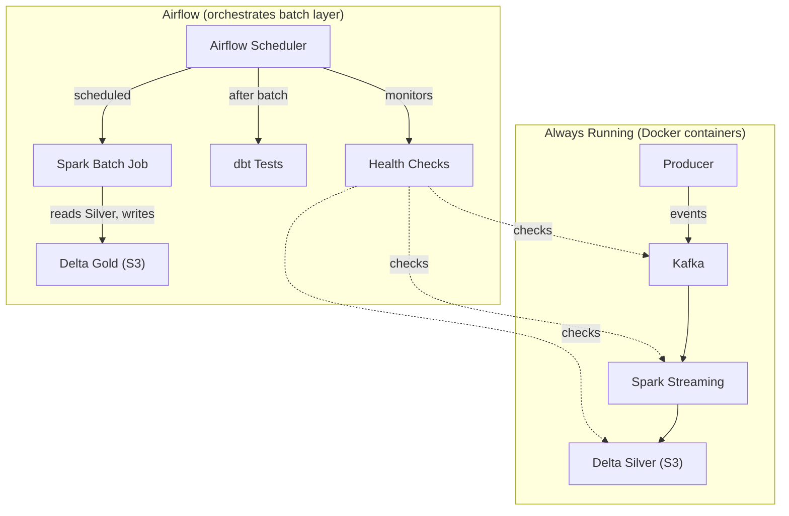
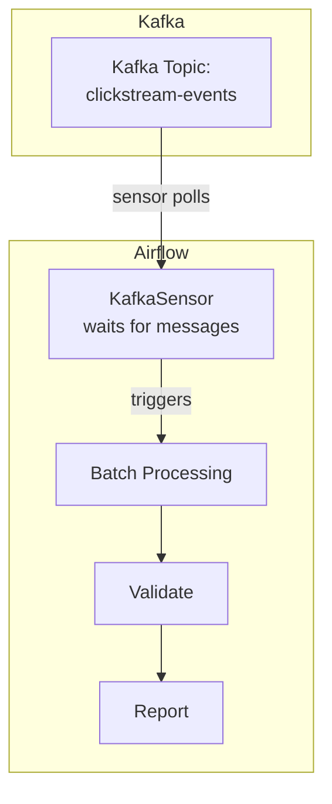

# Architecture Guide

This project is designed as a **Data Architecture Playground** where different orchestration and processing patterns can be explored, compared, and composed. This guide documents the available architectures, explains what is currently implemented, and describes how to configure the solution for each pattern.

---

## Current State

**What is running right now** with `docker compose up -d`:

```
Producer (Python)  →  Kafka  →  Spark Structured Streaming  →  Delta Lake Silver (S3)
                                                                      │
                                                               Spark Batch (on-demand)
                                                                      │
                                                               Delta Lake Gold (S3)
```

- The **streaming pipeline** runs continuously as Docker containers, independent of Airflow.
- **Airflow** provides a demo DAG and a health-monitoring DAG, but does **not** orchestrate the real pipeline.
- This is **Architecture A** (see below).

---

## Orchestration Architectures

The same data pipeline can be orchestrated in fundamentally different ways. Each approach has trade-offs that are worth understanding.

### Architecture A: Streaming-First (Current)




**How it works:**

- The streaming job runs as a long-lived Docker container (`streaming-job` service).
- It starts automatically with `docker compose up` and runs until stopped.
- Airflow monitors health but does not start, stop, or restart the streaming job.
- Batch aggregation (Silver → Gold) is triggered manually via `docker exec`.

**When to use this pattern:**

- Real-time data must be processed with minimal latency.
- The streaming job should survive Airflow outages.
- This is how Netflix, Uber, LinkedIn run their streaming workloads.

**Trade-offs:**


| Advantage                           | Disadvantage                                             |
| ----------------------------------- | -------------------------------------------------------- |
| Simplest to set up                  | No centralized orchestration                             |
| Low latency                         | Batch jobs must be triggered manually                    |
| Streaming survives Airflow downtime | Less visibility into pipeline health from a single UI    |
| No custom Airflow image needed      | Streaming job restart requires Docker-level intervention |


**Configuration:** This is the default. Just run `docker compose up -d`.

---

### Architecture B: Airflow-Orchestrated




**How it works:**

- Airflow submits the streaming job to the Spark cluster using `spark-submit --deploy-mode cluster --supervise`.
- The streaming DAG runs every minute, checks if the job is alive via the Spark Master REST API, and re-submits if needed.
- Batch DAG runs on a schedule (e.g., daily) to aggregate Silver → Gold and run dbt tests.
- Everything is visible in the Airflow UI.

**When to use this pattern:**

- You want a single control plane for all data workflows.
- Visibility and auditability are priorities.
- The team already uses Airflow as the standard orchestration tool.

**Trade-offs:**


| Advantage                                     | Disadvantage                                            |
| --------------------------------------------- | ------------------------------------------------------- |
| Single UI for all pipeline operations         | Requires custom Airflow image (Java + Spark + dbt)      |
| Automatic restart via DAG + `--supervise`     | More complex setup                                      |
| Audit trail of every submission               | If Airflow goes down, streaming job is not re-submitted |
| Consistent scheduling for batch and streaming | Higher resource usage (Airflow running spark-submit)    |


**Configuration:** Requires the custom Airflow image and new DAGs. See [roadmap.md](roadmap.md) (Custom Airflow Image and Airflow-orchestrated Spark sections) for implementation specs. **Not yet implemented.**

---

### Architecture C: Hybrid (Recommended for Production)




**How it works:**

- The streaming pipeline runs independently (same as Architecture A).
- Airflow orchestrates the **batch layer**: scheduled Silver → Gold aggregation, dbt quality checks, alerting.
- Airflow also monitors the streaming infrastructure via health DAGs.
- Streaming and batch concerns are separated.

**When to use this pattern:**

- The streaming layer must be highly available and independent.
- Batch processing needs scheduling, retries, and alerting.
- This is the most common pattern in production data platforms.

**Trade-offs:**


| Advantage                                  | Disadvantage                                                  |
| ------------------------------------------ | ------------------------------------------------------------- |
| Best of both worlds                        | Two systems to monitor (Docker + Airflow)                     |
| Streaming is resilient to Airflow failures | Slightly more complex than pure Architecture A                |
| Batch gets proper orchestration            | Custom Airflow image still needed for spark-submit batch jobs |
| Clean separation of concerns               | —                                                             |


**Configuration:** Requires custom Airflow image for batch spark-submit. Streaming layer is the current default. **Partially implemented** — streaming works, batch orchestration deferred.

---

### Architecture D: Event-Driven (Kafka-Triggered)




**How it works:**

- An Airflow KafkaSensor watches a Kafka topic for new messages.
- When messages arrive (or a threshold is met), the DAG triggers downstream processing.
- No fixed schedule — processing is driven by data availability.

**When to use this pattern:**

- Processing should happen as soon as data is available.
- You want to avoid fixed schedules that waste resources or add latency.
- Useful for event-driven microservices and real-time analytics.

**Trade-offs:**


| Advantage                            | Disadvantage                                     |
| ------------------------------------ | ------------------------------------------------ |
| Processes data as soon as it arrives | Requires `apache-airflow-providers-apache-kafka` |
| No wasted schedule runs              | Requires custom Airflow image                    |
| True event-driven architecture       | Sensor resource usage while waiting              |
| Good for variable-rate data          | More complex than time-based scheduling          |


**Configuration:** Requires custom Airflow image with `apache-airflow-providers-apache-kafka`. **Not yet implemented** — see roadmap.

---

## Storage Format Architectures

Orthogonal to the orchestration pattern, the **storage format** can also be swapped. See the main [README](../README.md) for diagrams.


| Scenario       | Storage Format | Query Engine | Status      |
| -------------- | -------------- | ------------ | ----------- |
| **Scenario 1** | Delta Lake     | Spark        | **Working** |
| **Scenario 2** | Delta Lake     | Trino + dbt  | Deferred    |
| **Scenario 3** | Hudi           | Spark        | Deferred    |


These can be combined with any orchestration architecture above. For example:

- Architecture A + Scenario 1 = what's running now
- Architecture B + Scenario 2 = Airflow-orchestrated pipeline with Trino and dbt
- Architecture C + Scenario 1 = Hybrid with scheduled batch aggregation

---

## How to Switch Architectures

### Currently Available


| Architecture            | How to Run                       |
| ----------------------- | -------------------------------- |
| **A (Streaming-First)** | `docker compose up -d` (default) |


### Future (After Roadmap Items)


| Architecture                 | Prerequisites                               | How to Run                                            |
| ---------------------------- | ------------------------------------------- | ----------------------------------------------------- |
| **B (Airflow-Orchestrated)** | Custom Airflow image, streaming/batch DAGs  | `docker compose --profile airflow-orchestrated up -d` |
| **C (Hybrid)**               | Custom Airflow image for batch spark-submit | `docker compose --profile hybrid up -d`               |
| **D (Event-Driven)**         | Custom Airflow image + kafka provider       | `docker compose --profile event-driven up -d`         |


> Docker Compose profiles are not yet implemented. See [roadmap.md](roadmap.md) for details.

---

## Related Documentation

- [roadmap.md](roadmap.md) — Deferred items, implementation specs, and future vision
- [airflow-migration-plan.md](airflow-migration-plan.md) — Migration from Airflow 2.3 to 2.4+ for `@continuous` scheduling

