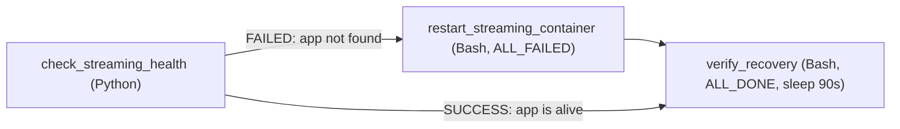
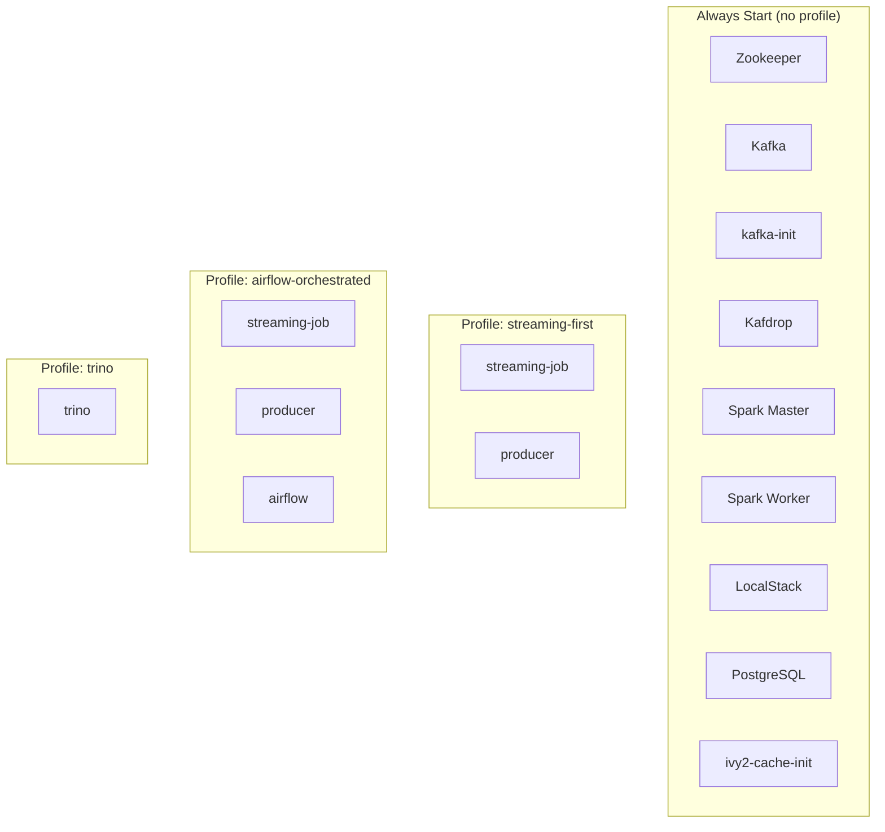

# Architecture Guide

This project is a **Data Architecture Playground** — students explore 4 Docker Compose scenarios, compare OSS tools to proprietary platforms, and mix-and-match components. Use the **Scenario Switcher Web UI** (`http://localhost:8084`) for a browser experience, or run Compose commands directly.

---

## Table of Contents

- [Scenarios](#scenarios)
- [Architecture Overview](#architecture-overview)
- [Orchestration](#orchestration)
  - [Airflow-Orchestrated (Scenario 2)](#airflow-orchestrated-scenario-2)
  - [Self-Healing Supervisor DAG](#self-healing-supervisor-dag)
  - [Why Airflow Cannot Fully Submit Streaming on Standalone](#why-airflow-cannot-fully-submit-streaming-on-standalone)
- [Storage Format Architectures](#storage-format-architectures)
- [Layer View](#layer-view)
- [How to Switch Scenarios](#how-to-switch-scenarios)
  - [Profile-to-service mapping](#profile-to-service-mapping)
- [Related Documentation](#related-documentation)

---

## Scenarios

Four scenarios are available — each introduces one new concept in the data stack:

| Scenario | What's New | Compose Command |
|---|---|---|
| **Streaming First** | Baseline: Delta Lake + Spark, no Airflow | `docker compose --profile streaming-first up -d` |
| **Airflow Orchestrated** | Airflow for streaming supervision + batch scheduling | `docker compose --profile airflow-orchestrated up -d` |
| **Trino SQL Engine** | Trino + Spark Thrift Server for SQL analytics | `docker compose --profile streaming-first --profile trino -f compose/scenario-2.yml up -d` |
| **Hudi Comparison** | Apache Hudi instead of Delta Lake | `docker compose --profile streaming-first -f compose/scenario-3.yml up -d` |

All scenarios share the same core pipeline: **Producer → Kafka → Spark Structured Streaming → Object Storage (S3)**. What differs is the orchestration layer, the query engine, and the storage format.

> **Prefer a browser?** Run `pip install -r requirements-web.txt && python playground_web.py` then open [http://localhost:8084](http://localhost:8084). The **Card View** lets you launch and inspect scenarios; the **Layer View** visualizes all 11 architecture layers with tool selection and platform comparisons. See [README.md](../README.md) for details.

---

## Architecture Overview

All scenarios share the same core data pipeline containers (`producer`, `streaming-job`, `spark-master`, `spark-worker`, Kafka, LocalStack, Postgres). Each scenario layers on top:

```
Producer (Python)  →  Kafka  →  Spark Structured Streaming  →  Storage on S3 (Delta or Hudi)
                                                                       │
                                                           Batch / SQL / Orchestration
                                                                       │
                                                                   Gold Layer
```

- **Streaming First**: batch triggered manually via `docker compose exec spark-master spark-submit`
- **Airflow Orchestrated**: Airflow runs the batch DAG and supervises streaming
- **Trino SQL Engine**: adds Trino + Spark Thrift for SQL queries
- **Hudi Comparison**: swaps storage format to Apache Hudi

---

## Orchestration

### Airflow-Orchestrated (Scenario 2)

Scenario 2 runs the same streaming container as Scenario 1, but Airflow is the operator:

- **`clickstream_streaming_supervisor` DAG** (every 5 min) — checks the Spark Master REST API; if no streaming app is active, restarts the `streaming-job` container via the Docker Engine API
- **`clickstream_batch` DAG** (manual trigger) — runs `spark-submit` from inside Airflow to aggregate Silver → Gold, then verifies Gold objects in S3
- **`pipeline_health_monitor` DAG** (every 5 min) — watches Kafka and S3

**Configuration:** `docker compose --profile airflow-orchestrated up -d`. See [`infrastructure.md`](infrastructure.md) for the custom Airflow image and DAG details.

### Self-Healing Supervisor DAG


```mermaid
graph LR
    CH["check_streaming_health (Python)"] -->|"FAILED: app not found"| RS["restart_streaming_container (Bash, ALL_FAILED)"]
    RS --> VR["verify_recovery (Bash, ALL_DONE, sleep 90s)"]
    CH -->|"SUCCESS: app is alive"| VR
```

The supervisor DAG uses the bind-mounted `/var/run/docker.sock` to restart the streaming-job container. This is the "Hybrid" pattern: the streaming container is self-managed, and Airflow is an external watcher (not the launcher).

### Why Airflow Cannot Fully Submit Streaming on Standalone

On Spark Standalone, PySpark applications are blocked from `--deploy-mode cluster`: *"Cluster deploy mode is currently not supported for python applications on standalone clusters."* And `--deploy-mode client` would run the driver inside Airflow, with `awaitTermination()` blocking the task forever.

This is a teaching point: **the orchestration pattern you can use is constrained by the cluster manager**. On YARN or Kubernetes, full Airflow submission would be possible; on Standalone, the Hybrid pattern is what you get.

> **Event-Driven (Architecture D)**: An Airflow KafkaSensor triggers processing on data arrival. Not yet implemented — requires `apache-airflow-providers-apache-kafka` in the custom Airflow image. See [`roadmap.md`](roadmap.md).

---

## Storage Format Architectures

Storage format is orthogonal to orchestration — any format works with any scenario:

| Scenario | Storage Format | Query Engine | Status |
|---|---|---|---|
| Streaming First | Delta Lake | Spark / `spark-sql` | Working |
| Airflow Orchestrated | Delta Lake | Spark / `spark-sql` | Working |
| Trino SQL Engine | Delta Lake | Trino + Spark Thrift | Working |
| Hudi Comparison | Apache Hudi | Spark | Working |

The `STORAGE_FORMAT` env var (`delta` / `hudi`) parameterizes both `streaming_job.py` and `batch_job.py`. Swapping the format changes package dependencies, writeStream configuration, table options, and S3 paths.

---

## Layer View

The Web UI includes a **Layer View** (`/layers`) that visualizes all 11 architecture layers as a table:

| Layer | Example Tools |
|---|---|
| Ingestion | Apache Kafka, (future: Debezium, Redpanda) |
| Stream Processing | Spark Structured Streaming, (future: Apache Flink) |
| Storage Format | Delta Lake, Apache Hudi, (future: Iceberg) |
| Object Storage | LocalStack S3, (future: MinIO) |
| Orchestration | Apache Airflow, (future: Prefect, Dagster) |
| Query Engine | spark-sql, Trino, Spark Thrift, (future: DuckDB) |
| Transform | spark-submit, Airflow DAGs, (future: dbt) |
| BI / Dashboard | (future: Metabase, Superset, Grafana) |
| Governance | (future: OpenLineage, DataHub) |
| Data Quality | (future: Great Expectations, Soda) |
| Exploration | (future: JupyterLab, Zeppelin) |

Click a scenario in the sidebar to see which tools it activates. Toggle reference stacks (Databricks, Microsoft Fabric, AWS) to compare proprietary equivalents per layer.

---

## How to Switch Scenarios

Docker Compose profiles control which services come up. Core infrastructure (Kafka, Spark, LocalStack, Postgres, Kafdrop) always starts.

| Scenario | Command |
|---|---|
| Streaming First | `docker compose --profile streaming-first up -d` |
| Airflow Orchestrated | `docker compose --profile airflow-orchestrated up -d` |
| Trino SQL Engine | `docker compose --profile streaming-first --profile trino -f compose/scenario-2.yml up -d` |
| Hudi Comparison | `docker compose --profile streaming-first -f compose/scenario-3.yml up -d` |
| Core infrastructure only | `docker compose up -d` |

Always run `docker compose down --remove-orphans` before switching. The `--remove-orphans` flag tears down containers not selected by the new profile, preventing leftover services from other scenarios.

### Profile-to-service mapping


```mermaid
graph TD
    subgraph core ["Always Start (no profile)"]
        ZK[Zookeeper]
        KF[Kafka]
        KI[kafka-init]
        KD[Kafdrop]
        SM[Spark Master]
        SW[Spark Worker]
        LS[LocalStack]
        PG[PostgreSQL]
        IVY[ivy2-cache-init]
    end

    subgraph sfProfile ["Profile: streaming-first"]
        SJ1[streaming-job]
        PR1[producer]
    end

    subgraph aoProfile ["Profile: airflow-orchestrated"]
        SJ2[streaming-job]
        PR2[producer]
        AF[airflow]
    end

    subgraph trProfile ["Profile: trino"]
        TR[trino]
    end
```

`streaming-job` and `producer` belong to both `streaming-first` and `airflow-orchestrated` — Compose instantiates them once even when both profiles are active.

---

## Related Documentation

- [`infrastructure.md`](infrastructure.md) — Service-by-service reference, custom Airflow image, DAGs, spark-thrift
- [`data-flow.md`](data-flow.md) — Pipeline journey: producer → Kafka → streaming → Silver → batch → Gold
- [`data-storage.md`](data-storage.md) — Storage at rest: S3 layout, S3A config, Delta features, full storage stack
- [`troubleshooting.md`](troubleshooting.md) — Common gotchas and fixes
- [`roadmap.md`](roadmap.md) — Deferred items, Component Evolution Roadmap
- [`layers-and-tools.md`](layers-and-tools.md) — Full tool catalog per layer
- [`reference-stack-mapping.md`](reference-stack-mapping.md) — All-in-one platform comparison tables
