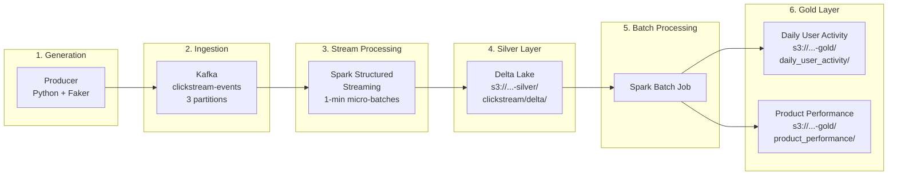

# Data Flow

This document describes how data moves through the pipeline, what transformations are applied at each stage, and how to inspect data at every step.

## End-to-End Flow



## Medallion Architecture

The pipeline follows the **Medallion Architecture** pattern with three layers:

| Layer | Location | Format | Contents |
| --- | --- | --- | --- |
| **Bronze** | Kafka topic `clickstream-events` | JSON | Raw events as produced (no transformation) |
| **Silver** | `s3a://user-behavior-analytics-silver/clickstream/delta/` | Delta Lake (Parquet) | Parsed JSON with processing timestamp added |
| **Gold** | `s3a://user-behavior-analytics-gold/` | Delta Lake (Parquet) | Aggregated analytics tables |

## Stage 1: Event Generation (Producer)

The producer generates synthetic clickstream events at a configurable rate (default: 1 event/second).

### Event Schema

```json
{
  "event_id": "uuid",
  "user_id": "uuid",
  "session_id": "uuid",
  "event_type": "page_view | product_view | add_to_cart | checkout | purchase",
  "product_id": "laptop | smartphone | headphones | tablet | smartwatch",
  "timestamp": "2026-04-14T21:30:00.000000",
  "page_url": "https://example.com/...",
  "user_agent": "Mozilla/5.0 ...",
  "ip_address": "192.168.1.1",
  "device_type": "mobile | desktop | tablet",
  "browser": "Chrome ...",
  "os": "Windows | macOS | Linux | iOS | Android",
  "country": "US",
  "referrer": "https://google.com/...",
  "screen_resolution": "1920x1080",
  "time_on_page": 42,
  "scroll_depth": 75,
  "click_coordinates": { "x": 500, "y": 300 }
}
```

### How to inspect

```bash
# Check producer is generating events
docker compose logs producer --tail 5

# Check event count
docker compose logs producer 2>&1 | tail -1
```

## Stage 2: Kafka (Bronze Layer)

Events are serialized as JSON and sent to the `clickstream-events` topic (3 partitions, replication factor 1).

A second topic `clickstream-errors` (1 partition) exists for dead-letter messages but is not currently used.

### How to inspect

```bash
# Via Kafdrop Web UI
open http://localhost:9033/topic/clickstream-events

# Via Kafka CLI (inside the container)
docker exec user-behavior-analytics-kafka-1 \
  kafka-console-consumer --bootstrap-server localhost:9092 \
    --topic clickstream-events --from-beginning --max-messages 1
```

## Stage 3: Stream Processing (Silver Layer)

Spark Structured Streaming reads from Kafka in **1-minute micro-batches**, parses the JSON, adds a `processing_timestamp`, and writes Delta Lake files to S3.

### Transformation

```
Kafka message (key=null, value=JSON bytes)
    → Cast value to string
    → Parse JSON using CLICKSTREAM_SCHEMA
    → Add processing_timestamp (current_timestamp())
    → Write as Delta Lake to Silver bucket
```

### Output location

```
s3://user-behavior-analytics-silver/
├── clickstream/delta/
│   ├── _delta_log/              # Delta Lake transaction log
│   │   ├── 00000000000000000000.json
│   │   ├── 00000000000000000001.json
│   │   └── ...
│   ├── part-00000-*.snappy.parquet   # Data files
│   └── ...
└── checkpoints/delta/           # Streaming checkpoint
    ├── commits/
    ├── metadata
    ├── offsets/
    └── sources/
```

### How to inspect

```bash
# Check streaming job is processing micro-batches
docker compose logs streaming-job 2>&1 | grep "DeltaSink" | tail -5

# List files in Silver bucket
docker exec user-behavior-analytics-localstack-1 \
  awslocal s3 ls s3://user-behavior-analytics-silver/clickstream/delta/ --recursive

# Check Spark Master UI for the running application
open http://localhost:8080
```

## Stage 4: Batch Processing (Gold Layer)

The batch job reads from Silver, creates two aggregated tables, and writes to Gold. It is run on-demand (not scheduled).

### Aggregation: Daily User Activity

Groups by `(date, user_id)` and computes:

| Column | Aggregation |
| --- | --- |
| `total_events` | `count(*)` |
| `sessions` | `countDistinct(session_id)` |
| `products_viewed` | `countDistinct(product_id)` |
| `purchases` | `sum(event_type == 'purchase')` |
| `avg_time_on_page` | `avg(time_on_page)` |

**Output:** `s3a://user-behavior-analytics-gold/daily_user_activity/` (partitioned by `date`)

### Aggregation: Product Performance

Groups by `(date, product_id)` and computes:

| Column | Aggregation |
| --- | --- |
| `total_views` | `count(*)` |
| `unique_users` | `countDistinct(user_id)` |
| `purchases` | `sum(event_type == 'purchase')` |
| `avg_time_on_page` | `avg(time_on_page)` |

**Output:** `s3a://user-behavior-analytics-gold/product_performance/` (partitioned by `date`)

### How to run

```bash
docker exec user-behavior-analytics-spark-master-1 \
  /opt/spark/bin/spark-submit \
    --master spark://spark-master:7077 \
    --conf spark.driver.extraJavaOptions=-Divy.home=/tmp/ivy2 \
    --packages io.delta:delta-spark_2.12:3.2.0,org.apache.hadoop:hadoop-aws:3.3.4,com.amazonaws:aws-java-sdk-bundle:1.12.262 \
    /opt/spark/app/src/batch/batch_job.py
```

### How to inspect

```bash
# List Gold layer data
docker exec user-behavior-analytics-localstack-1 \
  awslocal s3 ls s3://user-behavior-analytics-gold/ --recursive

# Check output
docker exec user-behavior-analytics-localstack-1 \
  awslocal s3 ls s3://user-behavior-analytics-gold/daily_user_activity/
docker exec user-behavior-analytics-localstack-1 \
  awslocal s3 ls s3://user-behavior-analytics-gold/product_performance/
```

## S3 Bucket Layout

```
LocalStack S3 (http://localstack:4566)
│
├── user-behavior-analytics-silver/
│   ├── clickstream/delta/           # Silver Delta table
│   │   ├── _delta_log/             #   Transaction log
│   │   └── *.snappy.parquet        #   Data files
│   └── checkpoints/delta/           # Streaming checkpoints
│       ├── commits/
│       ├── metadata
│       ├── offsets/
│       └── sources/
│
└── user-behavior-analytics-gold/
    ├── daily_user_activity/          # Gold Delta table
    │   ├── _delta_log/
    │   ├── date=2026-04-14/         #   Partitioned by date
    │   └── ...
    └── product_performance/          # Gold Delta table
        ├── _delta_log/
        ├── date=2026-04-14/         #   Partitioned by date
        └── ...
```

## S3A Configuration

All Spark jobs connect to LocalStack S3 using the S3A filesystem with these settings:

| Setting | Value | Purpose |
| --- | --- | --- |
| `fs.s3a.endpoint` | `http://localstack:4566` | LocalStack endpoint |
| `fs.s3a.access.key` | `test` | LocalStack default credentials |
| `fs.s3a.secret.key` | `test` | LocalStack default credentials |
| `fs.s3a.path.style.access` | `true` | Required for LocalStack (no virtual-hosted-style) |
| `fs.s3a.impl` | `org.apache.hadoop.fs.s3a.S3AFileSystem` | Hadoop S3A implementation |

## Delta Lake Features in Use

| Feature | Where | Details |
| --- | --- | --- |
| **ACID transactions** | Silver + Gold | Every micro-batch is an atomic commit |
| **Append mode** | Silver (streaming) | New events are appended, never overwritten |
| **Overwrite mode** | Gold (batch) | Aggregations are fully recomputed each run |
| **Partitioning** | Gold tables | Partitioned by `date` for efficient queries |
| **Checkpointing** | Streaming | Kafka offsets stored in `checkpoints/delta/` for exactly-once delivery |
| **VACUUM** | Batch job | Removes old files (retention: 168 hours) |

> **Note:** `OPTIMIZE ... ZORDER BY` is a Databricks-only feature and is not available in open-source Delta Lake. See [roadmap.md](roadmap.md) for details.
