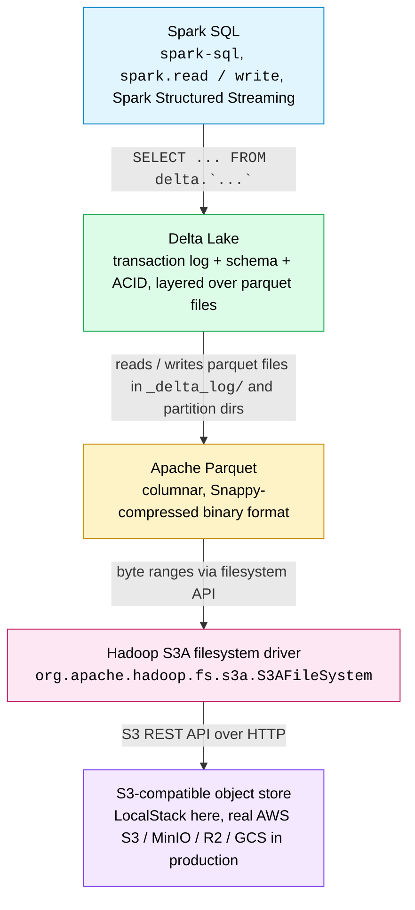

# Data Storage

This document describes how the data from the pipeline sits *at rest* on object storage: the bucket layout, the S3A configuration Spark uses to read and write it, the Delta Lake capabilities we rely on, and the full Spark SQL → Delta Lake → Parquet → S3A → S3 storage stack that makes queries like `SELECT * FROM delta.\`s3a://...` work.

For how data *moves* through the pipeline (producer → Kafka → streaming → Silver → batch → Gold), see [data-flow.md](data-flow.md).

## Table of Contents

- [S3 Bucket Layout](#s3-bucket-layout)
- [S3A Configuration](#s3a-configuration)
- [Delta Lake Features in Use](#delta-lake-features-in-use)
- [Storage Stack](#storage-stack)
  - [Spark SQL — the query layer](#spark-sql--the-query-layer)
  - [Delta Lake — the table format](#delta-lake--the-table-format)
  - [Apache Parquet — the file format](#apache-parquet--the-file-format)
  - [Hadoop S3A — the filesystem driver](#hadoop-s3a--the-filesystem-driver)
  - [S3-compatible object store — the bottom of the stack](#s3-compatible-object-store--the-bottom-of-the-stack)
  - [Walking a query through the stack](#walking-a-query-through-the-stack)
  - [Why this stack matters](#why-this-stack-matters)

## S3 Bucket Layout

```
LocalStack S3 (http://localstack:4566)
│
├── user-behavior-analytics-silver/
│   ├── clickstream/delta/           # Silver Delta table
│   │   ├── _delta_log/             #   Transaction log
│   │   └── *.snappy.parquet        #   Data files
│   └── checkpoints/delta/           # Streaming checkpoints
│       ├── commits/
│       ├── metadata
│       ├── offsets/
│       └── sources/
│
└── user-behavior-analytics-gold/
    ├── daily_user_activity/          # Gold Delta table
    │   ├── _delta_log/
    │   ├── date=2026-04-14/         #   Partitioned by date
    │   └── ...
    └── product_performance/          # Gold Delta table
        ├── _delta_log/
        ├── date=2026-04-14/         #   Partitioned by date
        └── ...
```

## S3A Configuration

All Spark jobs connect to LocalStack S3 using the S3A filesystem with these settings:


| Setting                    | Value                                    | Purpose                                           |
| -------------------------- | ---------------------------------------- | ------------------------------------------------- |
| `fs.s3a.endpoint`          | `http://localstack:4566`                 | LocalStack endpoint                               |
| `fs.s3a.access.key`        | `test`                                   | LocalStack default credentials                    |
| `fs.s3a.secret.key`        | `test`                                   | LocalStack default credentials                    |
| `fs.s3a.path.style.access` | `true`                                   | Required for LocalStack (no virtual-hosted-style) |
| `fs.s3a.impl`              | `org.apache.hadoop.fs.s3a.S3AFileSystem` | Hadoop S3A implementation                         |


## Delta Lake Features in Use


| Feature               | Where              | Details                                                                |
| --------------------- | ------------------ | ---------------------------------------------------------------------- |
| **ACID transactions** | Silver + Gold      | Every micro-batch is an atomic commit                                  |
| **Append mode**       | Silver (streaming) | New events are appended, never overwritten                             |
| **Overwrite mode**    | Gold (batch)       | Aggregations are fully recomputed each run                             |
| **Partitioning**      | Gold tables        | Partitioned by `date` for efficient queries                            |
| **Checkpointing**     | Streaming          | Kafka offsets stored in `checkpoints/delta/` for exactly-once delivery |
| **VACUUM**            | Batch job          | Removes old files (retention: 168 hours)                               |


> **Note:** `OPTIMIZE ... ZORDER BY` is a Databricks-only feature and is not available in open-source Delta Lake. See [roadmap.md](roadmap.md) for details.

## Storage Stack

Everything in this pipeline lands in the same place — a Delta table on LocalStack S3 — but a surprising number of independent layers cooperate to make that possible. This section explains what each one actually does, so that when you inspect a `.snappy.parquet` file or run a `spark-sql` query, you know **which layer is responsible for which behaviour**.




The next five sections walk the stack top-down, from the SQL query engine to the object store. The two sections after them trace a single query through the whole thing and summarise why this shape matters.

### Spark SQL — the query layer

When you run:

```sql
SELECT * FROM delta.`s3a://user-behavior-analytics-silver/clickstream/delta/` LIMIT 10;
```

Spark SQL parses the query, builds a logical plan, and hands table resolution to the Delta catalog (`spark.sql.catalog.spark_catalog=org.apache.spark.sql.delta.catalog.DeltaCatalog`). **Nothing below this layer knows about SQL.** The same Spark engine is what `streaming_job.py` (`spark.readStream.format("kafka")...writeStream.format("delta")`) and `batch_job.py` (`spark.read.format("delta")...groupBy(...).write.format("delta")`) use — they're different APIs over the same engine.

In the roadmap, **Trino + dbt** slots in as an alternative query layer. It reads the exact same Delta tables; only the engine above changes.

### Delta Lake — the table format

Delta Lake is **not a file format**. It is a set of rules for writing transaction records alongside parquet files so that a folder on object storage behaves like a transactional table.

A Delta table on disk is two things side-by-side:

```
clickstream/delta/
├── _delta_log/                    <- the transaction log (Delta's brain)
│   ├── 00000000000000000000.json
│   ├── 00000000000000000001.json
│   └── ...
├── part-00000-...snappy.parquet   <- plain parquet data files (Parquet's job)
├── part-00001-...snappy.parquet
└── ...
```

Every write (streaming micro-batch or batch append/overwrite) is three steps:

1. Spark writes one or more new `.snappy.parquet` files.
2. Spark appends one JSON commit file `_delta_log/00000000...000N.json` recording *"these parquet files were added; those were removed."*
3. A reader lists `_delta_log/`, replays JSON commits (from the latest checkpoint forward) to compute the active set of parquet files, and only reads those.

That trick — **transaction log over parquet files** — is what gives Delta:

- **ACID commits.** Readers always see a complete commit `N-1` or a complete commit `N`, never a half-written state. (See [Delta Lake Features in Use](#delta-lake-features-in-use).)
- **Time travel.** `VERSION AS OF 5` just replays the log up to commit 5.
- **Schema enforcement.** The schema is stored in the log, not inferred from files.
- `**MERGE`, `UPDATE`, `DELETE`** on top of immutable object storage — operations that plain parquet files cannot express.

Delta Lake is one of three mainstream lakehouse table formats; the other two are **Apache Iceberg** and **Apache Hudi**. They solve the same problem with slightly different transaction-log schemes — our [roadmap](roadmap.md#scenario-3-hudi-instead-of-delta-lake) includes swapping Delta for Hudi as a future exercise.

### Apache Parquet — the file format

All the actual event rows live inside Parquet files. Parquet is:

- **Columnar.** Rows are rotated 90° on disk: each column stored contiguously. A query like `SELECT COUNT(*) WHERE event_type = 'purchase'` only reads the `event_type` column, not all ~20. Huge speed and cost win over row-based formats like CSV or JSON.
- **Typed and self-describing.** Each file's footer carries the schema (column names, types, encodings). No external DDL needed to read it.
- **Compressed.** We use **Snappy** compression — visible in the `...snappy.parquet` suffix — which trades a little compression ratio for fast decode.
- **Chunked with statistics.** Files are split into row groups with per-column min/max/null-count stats, enabling **predicate pushdown** (row groups that cannot match a filter are skipped without being read).

Parquet is language- and engine-agnostic. The same `part-00000-...snappy.parquet` file can be read by Spark, Trino, DuckDB, pandas (via `pyarrow`), or Polars without any conversion — which is why a query engine swap doesn't require rewriting the data.

### Hadoop S3A — the filesystem driver

Spark is Hadoop-compatible. It does not know about HTTP, S3 API signatures, or AWS credentials; it talks to an abstract `org.apache.hadoop.fs.FileSystem` interface. **S3A** is the concrete implementation of that interface for any S3-compatible endpoint.

S3A is what `spark.hadoop.fs.s3a.endpoint=http://localstack:4566` and friends (full list in the [S3A Configuration](#s3a-configuration) table) configure. It handles:

- Multi-part uploads for large parquet files.
- Retries on transient HTTP errors.
- Directory-like listings (S3 is flat; S3A synthesises directories by treating the `/` separator as a prefix).
- Credential resolution (static keys here; IAM roles / STS in production).

**The S3A driver is what makes LocalStack and real AWS S3 interchangeable** — swap the endpoint and credentials, everything above this layer (Parquet, Delta, Spark SQL) stays byte-for-byte identical.

### S3-compatible object store — the bottom of the stack

At the bottom is the object store itself:

- **In this project:** [LocalStack](https://www.localstack.cloud/) running in a Docker container at `localstack:4566`, emulating the S3 API.
- **In production:** AWS S3, Google Cloud Storage (via its S3-compatible API), MinIO (on-prem / Kubernetes), Cloudflare R2, Backblaze B2 — any of them work with no code change above.

The object store's only job is to **serve byte ranges of objects over HTTP**. It has no idea about Parquet, Delta, tables, schemas, or transactions — all of that is layered on above.

### Walking a query through the stack

When you run the `spark-sql` step from the walkthrough:

```sql
SELECT event_type, COUNT(*) AS n
FROM delta.`s3a://user-behavior-analytics-silver/clickstream/delta/`
GROUP BY event_type ORDER BY n DESC;
```

1. **Spark SQL** parses and plans the query.
2. **Delta Lake** resolves the table: it lists `_delta_log/`, replays JSON commits to determine the active set of parquet files, and reads the schema from the log.
3. For each active parquet file, **Parquet** reads only the `event_type` column (columnar projection) and uses row-group statistics to skip any chunks that cannot contribute to the result.
4. Those column reads turn into **S3A** HTTP range requests.
5. **LocalStack** serves the bytes over its S3 API.

Then Spark aggregates, shuffles, and returns the grouped counts. Every layer did exactly one job; every layer is swappable for an equivalent without touching the others.

### Why this stack matters

This is the lakehouse pattern in one picture:

- **Object storage** is cheap, infinite, and boring — the perfect foundation.
- **A filesystem driver** lets generic big-data engines treat it like disk.
- **A file format** (Parquet) gives you columnar analytics performance without a database.
- **A table format** (Delta / Iceberg / Hudi) gives you ACID, schema evolution, and time travel without a database.
- **A query engine** (Spark SQL / Trino / DuckDB) queries it with familiar SQL.

No proprietary warehouse required, no vendor lock-in. That is why every modern data-platform talk mentions "lakehouse" — and you can now see exactly what the word stands for by looking inside `s3a://user-behavior-analytics-silver/` with your own eyes.