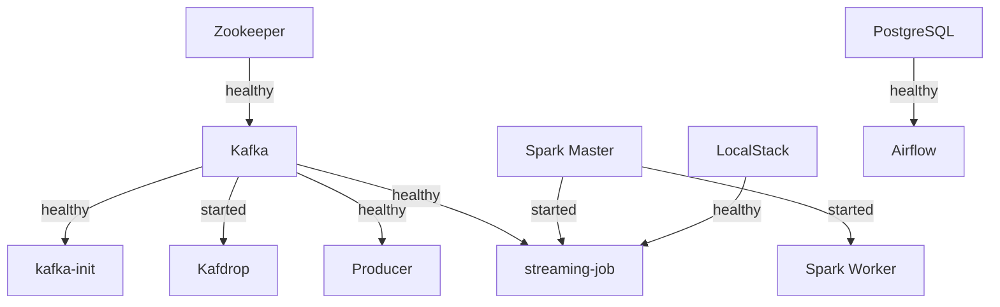

# Infrastructure

This document describes every Docker service, how they connect, and how they're configured.

## Service Overview

```
┌─────────────────────────────────────────────────────────────────────────────┐
│                         INFRASTRUCTURE LAYER                                │
│  ┌────────────┐  ┌────────────┐  ┌────────────┐  ┌────────────────────────┐ │
│  │ Zookeeper  │  │  Postgres  │  │ LocalStack │  │        Trino           │ │
│  │  :2181     │  │  (Airflow  │  │ (S3)       │  │  (SQL Query Engine)    │ │
│  │            │  │   metadata)│  │  :4566     │  │        :8082           │ │
│  └────────────┘  └────────────┘  └────────────┘  └────────────────────────┘ │
└─────────────────────────────────────────────────────────────────────────────┘

┌─────────────────────────────────────────────────────────────────────────────┐
│                           MESSAGING LAYER                                   │
│  ┌────────────┐  ┌────────────┐  ┌────────────┐                             │
│  │   Kafka    │──│ kafka-init │  │  Kafdrop   │                             │
│  │   :9092    │  │ (creates   │  │ (Kafka UI) │                             │
│  │            │  │  topics)   │  │   :9033    │                             │
│  └────────────┘  └────────────┘  └────────────┘                             │
└─────────────────────────────────────────────────────────────────────────────┘

┌─────────────────────────────────────────────────────────────────────────────┐
│                         PROCESSING LAYER                                    │
│  ┌──────────────┐  ┌──────────────┐  ┌───────────────┐  ┌────────────────┐  │
│  │ spark-master │  │ spark-worker │  │ streaming-job │  │    producer    │  │
│  │    :7077     │  │  (executes   │  │  (Spark app   │  │  (Python app   │  │
│  │    :8080     │  │   tasks)     │  │   on cluster) │  │   on Kafka)    │  │
│  └──────────────┘  └──────────────┘  └───────────────┘  └────────────────┘  │
└─────────────────────────────────────────────────────────────────────────────┘

┌─────────────────────────────────────────────────────────────────────────────┐
│                        ORCHESTRATION LAYER                                  │
│  ┌──────────────────────────────────────────────────────────────────────┐   │
│  │                           Airflow :8081                              │   │
│  │  ┌───────────────────────┐  ┌──────────────────────────────────┐    │   │
│  │  │ clickstream_pipeline  │  │ pipeline_health_monitor          │    │   │
│  │  │ (demo, manual trigger)│  │ (checks Kafka, Spark, S3)       │    │   │
│  │  └───────────────────────┘  └──────────────────────────────────┘    │   │
│  └──────────────────────────────────────────────────────────────────────┘   │
└─────────────────────────────────────────────────────────────────────────────┘
```

## Services

### Zookeeper

| Property | Value |
| --- | --- |
| Image | `confluentinc/cp-zookeeper:7.0.0` |
| Platform | `linux/amd64` (no ARM64 version available) |
| Port | 2181 |
| Purpose | Kafka cluster coordination |
| Healthcheck | `echo srvr \| nc localhost 2181 \| grep Zookeeper` |
| Notes | Under QEMU emulation on ARM Macs, startup takes 1-2 minutes. `start_period` is set to 120s to accommodate this. |

### Kafka

| Property | Value |
| --- | --- |
| Image | `confluentinc/cp-kafka:7.0.0` |
| Platform | `linux/amd64` (no ARM64 version available) |
| Port | 9092 (external), 29092 (internal Docker network) |
| Purpose | Message broker for clickstream events |
| Healthcheck | `kafka-topics --bootstrap-server localhost:9092 --list` |
| Depends on | Zookeeper (healthy) |

**Listeners:**
- `PLAINTEXT://kafka:29092` — used by services inside the Docker network (producer, streaming-job, Kafdrop)
- `PLAINTEXT_HOST://localhost:9092` — used from the host machine

### kafka-init

| Property | Value |
| --- | --- |
| Image | `confluentinc/cp-kafka:7.0.0` |
| Purpose | One-shot container to create Kafka topics on startup |
| Depends on | Kafka (healthy) |
| Script | `scripts/kafka-init/init-kafka-topics.sh` |
| Restart | `no` (exits after topics are created) |

Creates two topics:
- `clickstream-events` (3 partitions) — main event stream
- `clickstream-errors` (1 partition) — dead-letter queue

### Kafdrop

| Property | Value |
| --- | --- |
| Image | `obsidiandynamics/kafdrop` |
| Port | 9033 (host) → 9000 (container) |
| Purpose | Kafka Web UI for topic inspection and message browsing |
| URL | http://localhost:9033 |
| Depends on | Kafka |

> Port 9033 is used because ports 9000-9002 are commonly occupied by other services (e.g., MinIO, Portainer).

### Spark Master

| Property | Value |
| --- | --- |
| Image | `spark:3.5.3-scala2.12-java17-python3-ubuntu` |
| Ports | 8080 (Web UI), 7077 (cluster manager) |
| Purpose | Spark standalone cluster manager |
| URL | http://localhost:8080 |
| Volumes | `./src` → `/opt/spark/app/src` (read-only), `ivy2-cache` → `/tmp/ivy2` |

### Spark Worker

| Property | Value |
| --- | --- |
| Image | `spark:3.5.3-scala2.12-java17-python3-ubuntu` |
| Purpose | Executes Spark tasks assigned by the master |
| Memory | 1G |
| Cores | 1 |
| Depends on | Spark Master |
| Volumes | Same as Spark Master |

### streaming-job

| Property | Value |
| --- | --- |
| Image | `spark:3.5.3-scala2.12-java17-python3-ubuntu` |
| Purpose | Runs Spark Structured Streaming: Kafka → Delta Lake |
| Depends on | Kafka (healthy), LocalStack (healthy), Spark Master (started) |
| Volumes | `./src` → `/opt/spark/app/src` (read-only), `ivy2-cache` → `/tmp/ivy2` |

**Startup sequence:**
1. Waits for LocalStack init scripts to complete (polls `/_localstack/init/ready`)
2. Runs `spark-submit --master spark://spark-master:7077` with all Maven packages
3. Downloads Maven dependencies to ivy2-cache volume (first start takes 1-2 minutes)
4. Connects to Kafka, starts consuming from `clickstream-events`
5. Writes Delta Lake files to `s3a://user-behavior-analytics-silver/clickstream/delta`

**Environment variables:**
- `KAFKA_BOOTSTRAP_SERVERS=kafka:29092`
- `S3_ENDPOINT=http://localstack:4566`
- `AWS_ACCESS_KEY_ID=test`
- `AWS_SECRET_ACCESS_KEY=test`

### Producer

| Property | Value |
| --- | --- |
| Image | Custom (`docker/producer/Dockerfile`: Python 3.11-slim + kafka-python + faker) |
| Purpose | Generates synthetic clickstream events and sends to Kafka |
| Depends on | Kafka (healthy) |
| Restart | `on-failure` |
| Volumes | `./src/producer` → `/app` (read-only) |

**Environment variables:**
- `KAFKA_BOOTSTRAP_SERVERS=kafka:29092`
- `PYTHONUNBUFFERED=1` (ensures logs are visible immediately)
- `EVENT_INTERVAL=1.0` (seconds between events, configurable)

### Airflow

| Property | Value |
| --- | --- |
| Image | `apache/airflow:2.3.0` (vanilla, no custom build) |
| Port | 8081 (host) → 8080 (container) |
| Purpose | Pipeline orchestration and monitoring |
| URL | http://localhost:8081 |
| Credentials | admin / admin |
| Executor | LocalExecutor (backed by PostgreSQL) |
| Depends on | PostgreSQL (healthy) |

**Volumes:**
- `./dags` → `/opt/airflow/dags` (DAG definitions)
- `./src` → `/opt/airflow/dags/src` (source code, accessible from DAGs)
- `./dbt` → `/opt/airflow/dags/dbt` (dbt project)

**DAGs:**
- `clickstream_pipeline` — manual trigger, demo pipeline with PythonOperator tasks
- `pipeline_health_monitor` — every 5 minutes, checks Kafka/Spark/S3 health

> Airflow does **not** orchestrate the real streaming pipeline in the current setup (Architecture A). See [architecture-guide.md](architecture-guide.md) for alternative patterns.

### PostgreSQL

| Property | Value |
| --- | --- |
| Image | `postgres:13` |
| Port | 5432 (internal only, not exposed to host) |
| Purpose | Airflow metadata database |
| Credentials | airflow / airflow |
| Volume | `postgres-db-volume` |
| Healthcheck | `pg_isready -U airflow` |

### Trino

| Property | Value |
| --- | --- |
| Image | `trinodb/trino:380` |
| Port | 8082 (host) → 8080 (container) |
| Purpose | SQL query engine (deferred — no catalog configured) |
| URL | http://localhost:8082 |
| Volumes | `./config/trino` → `/etc/trino` |

> Trino starts and is accessible but has no Delta Lake catalog configured. See [roadmap.md](roadmap.md) for details.

### LocalStack

| Property | Value |
| --- | --- |
| Image | `localstack/localstack:3.8` |
| Ports | 4566 (gateway), 4510-4559 (external services) |
| Purpose | Local AWS S3 (and Redshift) emulation |
| Services | `s3`, `redshift` |
| Healthcheck | `curl -sf http://localhost:4566/_localstack/health \| grep '"s3"'` |

**Init scripts:**
- `scripts/localstack-init/init-s3-buckets.sh` is mounted at `/etc/localstack/init/ready.d/`
- Creates `user-behavior-analytics-silver` and `user-behavior-analytics-gold` buckets on startup
- The script **must have execute permissions** on the host (`chmod +x`)

## Startup Dependencies



## Volumes

| Volume | Mounted To | Purpose |
| --- | --- | --- |
| `postgres-db-volume` | PostgreSQL `/var/lib/postgresql/data` | Airflow metadata persistence |
| `localstack-volume` | LocalStack `/var/lib/localstack` | S3 bucket data (Delta Lake tables) |
| `ivy2-cache` | Spark containers `/tmp/ivy2` | Maven dependency cache (avoids re-downloading JARs on restart) |

## Network

All services are on the default Docker Compose bridge network (`user-behavior-analytics_default`). Services reference each other by service name (e.g., `kafka:29092`, `spark-master:7077`, `localstack:4566`).

## Web UIs

| Service | URL | Purpose |
| --- | --- | --- |
| Spark Master | http://localhost:8080 | Cluster status, running/completed applications, worker details |
| Airflow | http://localhost:8081 | DAG management, task logs, trigger runs (admin/admin) |
| Trino | http://localhost:8082 | SQL query interface (no catalog configured yet) |
| Kafdrop | http://localhost:9033 | Kafka topic inspection, message browsing, partition details |
| LocalStack | http://localhost:4566 | AWS API endpoint (use with `aws --endpoint-url=http://localhost:4566 s3 ls`) |

## Environment Variable Reference

See `env.sample` in the project root for all configurable environment variables with documentation.
