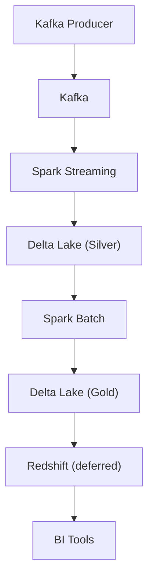
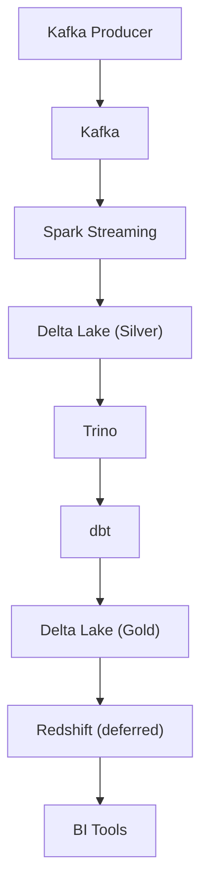
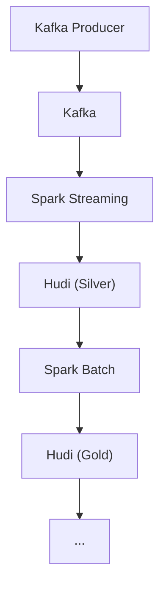
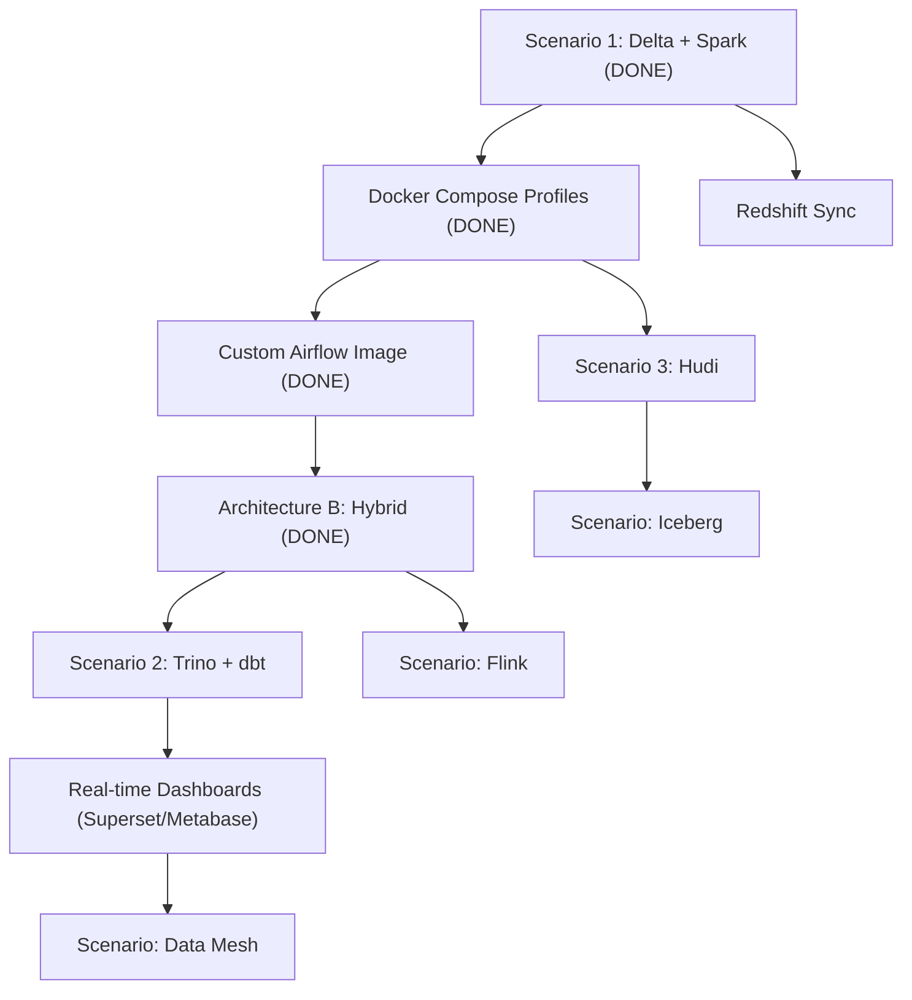

# Roadmap: Data Architecture Playground

## Table of Contents

- [Vision](#vision)
- [Current State](#current-state)
- [Deferred Items](#deferred-items)
  - [Summary](#summary)
  - [Redshift Sync](#redshift-sync)
  - [Delta Table Compaction (ZORDER)](#delta-table-compaction-zorder)
  - [Trino Catalog Configuration](#trino-catalog-configuration)
  - [Spark Thrift Server](#spark-thrift-server)
  - [dbt Integration](#dbt-integration)
  - [Hudi Storage Format](#hudi-storage-format)
  - [Docker Compose Profiles ✓ Done](#docker-compose-profiles--done)
  - [Custom Airflow Image ✓ Done](#custom-airflow-image--done)
  - [Airflow-Orchestrated Spark (Architecture B DAGs) ✓ Done as Hybrid](#airflow-orchestrated-spark-architecture-b-dags--done-as-hybrid)
  - [~~Airflow 2.4+ Migration~~ (Done)](#airflow-24-migration-done)
- [Architecture Scenario Roadmap](#architecture-scenario-roadmap)
  - [Scenario 1: Delta Lake + Spark (Current)](#scenario-1-delta-lake--spark-current)
  - [Scenario 2: Delta Lake + Trino + dbt](#scenario-2-delta-lake--trino--dbt)
  - [Scenario 3: Hudi instead of Delta Lake](#scenario-3-hudi-instead-of-delta-lake)
  - [Orchestration Architectures](#orchestration-architectures)
  - [Future Scenarios (Ideas)](#future-scenarios-ideas)
- [Implementation Priority](#implementation-priority)

## Vision

This project aims to become a **Data Architecture Playground and Laboratory** where students can explore, compare, and compose different Modern Data Architecture patterns using real, running infrastructure -- all locally with Docker.

Rather than learning about data architectures in theory, students will be able to:

- **Start any architecture scenario** with a single command
- **Compare approaches** side-by-side (e.g., Delta Lake vs Hudi, Spark vs Trino)
- **Swap components** to understand trade-offs (e.g., switch the compute engine, change the storage format)
- **Create custom compositions** by mixing and matching components

---

## Current State

**Implemented: Scenario 1 (Delta Lake + Spark) -- minus Redshift sync**

```
Producer -> Kafka -> Spark Streaming -> Delta Lake Silver (S3) -> Spark Batch -> Delta Lake Gold (S3)
```

The pipeline runs end-to-end locally with Docker Compose under **two switchable architectures**:

- **Architecture A (Streaming-First)** -- `docker compose --profile streaming-first up -d`. The streaming job runs as a continuous Docker container; batch is triggered manually.
- **Architecture B (Hybrid with Airflow)** -- `docker compose --profile airflow-orchestrated up -d`. Same streaming container, but Airflow supervises it (auto-restart via the Docker Engine API when the Spark app dies) and orchestrates batch (`spark-submit` from inside Airflow).

See [architecture-guide.md](architecture-guide.md) for all orchestration patterns (streaming-first, Airflow-orchestrated, hybrid, event-driven) and how to configure them.

---

## Deferred Items

Items not covered by the current implementation, organized by category.

### Summary


| Item                            | Category       | Blocked By                                                      | Effort | Status            |
| ------------------------------- | -------------- | --------------------------------------------------------------- | ------ | ----------------- |
| Redshift sync                   | Scenario 1     | No JDBC driver in Spark image                                   | Medium | Deferred          |
| Delta table compaction (ZORDER) | Scenario 1     | OSS Delta Lake limitation                                       | Low    | Deferred          |
| Trino catalog configuration     | Scenario 2     | Deleted `hive.properties`, no Delta connector                   | Medium | Deferred          |
| Spark Thrift Server             | Scenario 2     | Not deployed as Docker service                                  | Medium | Deferred          |
| dbt integration                 | Scenario 2     | Thrift Server missing, `profiles.yml` broken, dbt not installed | High   | Deferred          |
| Hudi storage format             | Scenario 3     | Code commented out, Hudi JARs not configured                    | Medium | Deferred          |
| Docker Compose profiles         | Infrastructure | -                                                               | Medium | **Done**          |
| Custom Airflow image            | Infrastructure | -                                                               | High   | **Done**          |
| Airflow-orchestrated Spark      | Infrastructure | PySpark/Standalone `--deploy-mode cluster` limit (see below)    | High   | **Done (Hybrid)** |


### Redshift Sync

**Category:** Scenario 1 completion
**Current state:** `sync_to_redshift()` in `src/batch/batch_job.py` is wrapped in a conditional and skipped when `REDSHIFT_URL` is not configured.
**What's needed:**

- Add PostgreSQL JDBC JAR to Spark packages
- Configure LocalStack Redshift endpoint properly
- Verify JDBC connectivity from Spark to LocalStack Redshift
- Test write from Gold layer to Redshift tables
**Reference:** The `.env` file already has Redshift connection variables defined.

### Delta Table Compaction (ZORDER)

**Category:** Scenario 1 optimization
**Current state:** `compact_delta_tables()` in `src/batch/batch_job.py` uses `OPTIMIZE ... ZORDER BY` which is a Databricks-only feature not available in OSS Delta Lake. The call is skipped.
**What's needed:**

- Replace ZORDER with plain `OPTIMIZE` (supported in Delta Lake 3.x OSS)
- Or remove ZORDER and rely on `VACUUM` only for storage management
- Consider adding partition-level compaction strategies

### Trino Catalog Configuration

**Category:** Scenario 2 enablement
**Current state:** Trino starts via Docker Compose (port 8082) but has no catalogs. The original `config/trino/catalog/hive.properties` was deleted from git.
**What's needed:**

- Create `config/trino/catalog/delta.properties` with Delta Lake connector configuration
- Configure S3A endpoint, credentials, and path-style access for LocalStack
- Test querying Delta Lake Silver and Gold tables via Trino CLI or UI
**Reference:** Trino config is mounted from `./config/trino` to `/etc/trino`.

### Spark Thrift Server

**Category:** Scenario 2 enablement
**Current state:** Not deployed. Required by dbt-spark for thrift connection method.
**What's needed:**

- Add `spark-thrift` service to `docker-compose.yml`
- Configure with Delta Lake extensions and S3A access
- Add healthcheck on port 10000
- Expose port 10000 for dbt and external tools

Reference docker-compose spec

```yaml
spark-thrift:
  image: spark:3.5.3-scala2.12-java17-python3-ubuntu
  command: >
    /opt/spark/sbin/start-thriftserver.sh
    --master spark://spark-master:7077
    --hiveconf hive.server2.thrift.port=10000
    --conf spark.sql.extensions=io.delta.sql.DeltaSparkSessionExtension
    --conf spark.sql.catalog.spark_catalog=org.apache.spark.sql.delta.catalog.DeltaCatalog
    --conf spark.hadoop.fs.s3a.endpoint=http://localstack:4566
    --conf spark.hadoop.fs.s3a.access.key=test
    --conf spark.hadoop.fs.s3a.secret.key=test
    --conf spark.hadoop.fs.s3a.path.style.access=true
    --packages io.delta:delta-spark_2.12:3.2.0,org.apache.hadoop:hadoop-aws:3.3.4,com.amazonaws:aws-java-sdk-bundle:1.12.262
  ports:
    - "10000:10000"
  environment:
    - SPARK_NO_DAEMONIZE=true
  depends_on:
    - spark-master
  healthcheck:
    test: ["CMD-SHELL", "nc -z localhost 10000"]
    interval: 10s
    timeout: 5s
    retries: 10
    start_period: 60s
```

### dbt Integration

**Category:** Scenario 2 completion
**Current state:** dbt directory exists with models and tests but: `profiles.yml` has duplicate YAML keys, `sources.yml` is missing, test files contain multiple queries, and dbt-spark is not installed anywhere.
**What's needed:**

- Fix `dbt/profiles.yml` (remove duplicate keys, use env vars for Spark Thrift connection)
- Create `dbt/models/staging/sources.yml`
- Split multi-query test files into individual test files
- Ensure dbt-spark is available (either in custom Airflow image or a dedicated dbt container)
- Test `dbt run` and `dbt test` against Spark Thrift Server
**Depends on:** Spark Thrift Server

### Hudi Storage Format

**Category:** Scenario 3 enablement
**Current state:** Hudi writeStream code is commented out in `src/streaming/streaming_job.py`. The producer and Kafka infrastructure are shared and already working.
**What's needed:**

- Uncomment Hudi writeStream configuration in `streaming_job.py`
- Add Hudi Maven packages (`hudi-spark3.5-bundle_2.12`) to `spark.jars.packages`
- Create a separate S3 bucket for Hudi data (or use a path prefix)
- Adjust batch job to read from Hudi tables
- Test Hudi timeline and compaction features

### Docker Compose Profiles ✓ Done

**Category:** Infrastructure
**What shipped:**

- Profiles: `streaming-first`, `airflow-orchestrated`, `trino` (reserved for Scenario 2).
- Core services (Zookeeper, Kafka, Spark master/worker, LocalStack, Postgres, `ivy2-cache-init`) stay profile-less so they always start.
- Pipeline workers (`streaming-job`, `producer`) belong to **both** architecture profiles because both architectures drive the same data flow.
- A bare `docker compose up -d` now starts only the core infrastructure (breaking change, documented in the README).

See [docker-compose.yml](../docker-compose.yml) and [architecture-guide.md](architecture-guide.md#profile-to-service-mapping).

### Custom Airflow Image ✓ Done

**Category:** Infrastructure
**What shipped** (see `[docker/airflow/Dockerfile](../docker/airflow/Dockerfile)`):

- Base image: `apache/airflow:3.2.0`.
- OpenJDK 17 installed from apt (JAVA_HOME resolved at build time so the image works on both amd64 and arm64).
- Apache Spark 3.5.3 binaries copied via multi-stage build from `spark:3.5.3-scala2.12-java17-python3-ubuntu` -- guarantees version parity with the cluster and avoids flaky downloads from `archive.apache.org`.
- Python packages: `kafka-python`, `faker`, `python-dotenv`, `apache-airflow-providers-apache-spark`. `dbt-spark[PyHive]` deferred to Scenario 2.
- `airflow` user added to a `docker` group (gid 999) so the supervision DAG can talk to `/var/run/docker.sock`. Linux hosts with a different docker-gid need the `group_add` workaround documented in [troubleshooting.md](troubleshooting.md).
- `/tmp/ivy2` pre-created with 777 permissions so the shared `ivy2-cache` volume is writable by uid 50000 (Airflow) alongside uid 185 (Spark).

### Airflow-Orchestrated Spark (Architecture B DAGs) ✓ Done as Hybrid

**Category:** Infrastructure
**What shipped:**

- `[dags/clickstream_streaming_dag.py](../dags/clickstream_streaming_dag.py)` -- supervises, not submits. Every 5 minutes it calls the Spark Master REST API and, if no streaming app is active, restarts the streaming-job container via the Docker Engine API over the bind-mounted `/var/run/docker.sock`. A `verify_recovery` task waits 90s and re-checks. `max_active_runs=1`.
- `[dags/clickstream_batch_dag.py](../dags/clickstream_batch_dag.py)` -- manual trigger. Runs `spark-submit` (with `-Divy.home=/tmp/ivy2` pointed at the shared cache) and verifies Gold-layer objects in S3.
- `[dags/pipeline_health_dag.py](../dags/pipeline_health_dag.py)` -- updated to monitor Kafka and S3 only; Spark streaming health is now owned by the supervisor DAG so the two DAGs do not duplicate work on the same 5-minute schedule.
- `docker-compose.yml` airflow service: added `AIRFLOW_CONN_SPARK_DEFAULT=spark://spark-master:7077`, `ivy2-cache` and `/var/run/docker.sock` volume mounts, expanded `depends_on` (kafka, spark-master, localstack, ivy2-cache-init), and `restart: unless-stopped`.

#### Why the streaming job cannot be submitted from Airflow on Spark Standalone

The original roadmap called for submitting the streaming job from Airflow via `spark-submit --deploy-mode cluster --supervise`. That pattern is **the right approach on YARN or Kubernetes**, but **Spark Standalone does not support it for PySpark applications**. Specifically:

- `--deploy-mode cluster` is explicitly blocked for Python apps on the Standalone cluster manager: *"Cluster deploy mode is currently not supported for python applications on standalone clusters."* This limitation is permanent for Standalone.
- `--deploy-mode client` would run the driver inside the Airflow task, and `streaming_job.py` calls `awaitTermination()` -- so the Airflow task would block forever and never complete.

The Hybrid pattern (streaming container + Airflow supervision) is the only way to get "Airflow in the loop" for the streaming layer on this cluster manager. Switching to YARN or K8s would unlock full Airflow submission -- a valuable teaching point about how infrastructure choices constrain orchestration patterns.

### ~~Airflow 2.4+ Migration~~ (Done)

Airflow has been upgraded directly from 2.3.0 to **3.2.0**, which includes `@continuous` scheduling, data-aware workflows (Assets), and the modern FastAPI-based UI. No custom image needed for this — the vanilla `apache/airflow:3.2.0` image is used with `SimpleAuthManager` (no login required).

---

## Architecture Scenario Roadmap

### Scenario 1: Delta Lake + Spark (Current)




**Status:** Working (minus Redshift sync)


| Milestone                                                  | Status   | Description                                         |
| ---------------------------------------------------------- | -------- | --------------------------------------------------- |
| Core pipeline (Producer -> Kafka -> Spark -> Delta Silver) | Done     | Events flowing end-to-end                           |
| Batch aggregation (Silver -> Gold)                         | Done     | On-demand via `docker compose exec`                 |
| Redshift sync (Gold -> Redshift)                           | Deferred | Needs JDBC driver and LocalStack Redshift config    |
| BI Tools integration                                       | Future   | Depends on Redshift; could add Metabase or Superset |


### Scenario 2: Delta Lake + Trino + dbt




**Status:** Not started -- Trino starts but has no catalog; dbt not configured


| Milestone                    | Status      | Description                                                |
| ---------------------------- | ----------- | ---------------------------------------------------------- |
| Trino catalog for Delta Lake | Not started | Create `delta.properties` with S3A/Delta connector         |
| Spark Thrift Server          | Not started | Deploy as Docker service for dbt connection                |
| dbt models and tests         | Not started | Fix `profiles.yml`, install dbt-spark                      |
| dbt-driven Gold layer        | Not started | Use dbt to transform Silver -> Gold instead of Spark batch |
| Redshift sync                | Not started | Same as Scenario 1                                         |


### Scenario 3: Hudi instead of Delta Lake




**Status:** Not started -- code is commented out


| Milestone                | Status      | Description                                                    |
| ------------------------ | ----------- | -------------------------------------------------------------- |
| Hudi streaming write     | Not started | Uncomment and configure Hudi writeStream in `streaming_job.py` |
| Hudi Maven packages      | Not started | Add `hudi-spark3.5-bundle_2.12` to packages                    |
| Hudi batch aggregation   | Not started | Adapt batch job to read/write Hudi tables                      |
| Hudi timeline management | Not started | Configure compaction strategy, explore timeline API            |


### Orchestration Architectures

In addition to storage format scenarios, the project supports different **orchestration patterns** (see [architecture-guide.md](architecture-guide.md) for full details):


| Architecture                   | Description                                                                    | Status                                                   |
| ------------------------------ | ------------------------------------------------------------------------------ | -------------------------------------------------------- |
| **A: Streaming-First**         | Streaming runs as Docker containers; batch triggered manually                  | **Working** (`--profile streaming-first`)                |
| **B: Hybrid with Airflow**     | Streaming runs as a container; Airflow supervises it and orchestrates batch    | **Working** (`--profile airflow-orchestrated`)           |
| B-alt: Full Airflow submission | Airflow submits streaming via `spark-submit --deploy-mode cluster --supervise` | Not possible on Spark Standalone (see section above)     |
| **D: Event-Driven**            | Airflow KafkaSensor triggers processing on data arrival                        | Deferred (needs `apache-airflow-providers-apache-kafka`) |


### Future Scenarios (Ideas)

These are additional architecture patterns that could be added to expand the playground:


| Scenario                         | Description                                               | New Components                                              |
| -------------------------------- | --------------------------------------------------------- | ----------------------------------------------------------- |
| **Iceberg**                      | Apache Iceberg as an alternative lakehouse format         | Iceberg Spark runtime, Iceberg catalog                      |
| **Flink instead of Spark**       | Replace Spark Streaming with Apache Flink                 | Flink JobManager, TaskManager, Flink SQL                    |
| **Debezium CDC**                 | Change Data Capture from a relational database            | Debezium, Kafka Connect, source database (MySQL/Postgres)   |
| **Real-time dashboards**         | Live dashboards on streaming data                         | Apache Superset or Metabase, connected to Trino             |
| **Data mesh**                    | Multiple domain-specific pipelines sharing infrastructure | Multiple producers, domain-specific schemas, data contracts |
| **Lakehouse with Unity Catalog** | Centralized governance and catalog                        | Unity Catalog (OSS), or Polaris catalog                     |
| **Stream processing patterns**   | Windowing, joins, late data handling                      | Enhanced streaming jobs, watermarking                       |
| **Data quality framework**       | Great Expectations or Soda for data validation            | Great Expectations container, quality reports UI            |
| **ML feature store**             | Feature engineering pipeline feeding an ML store          | Feast, feature tables in Gold layer                         |
| **Multi-cloud simulation**       | MinIO instead of LocalStack for S3                        | MinIO, multi-region replication                             |


---

## Implementation Priority

Recommended order for expanding the playground beyond the current state:




The first three priorities have shipped (Profiles, Custom Airflow Image, Hybrid orchestration). Remaining priorities:

1. **Scenario 2 (Trino + dbt)** -- most requested by data engineering students. Unlocks a real query layer over the Gold bucket and contrasts nicely with the current `spark-sql` direct-query experience described in the README.
2. **Scenario 3 (Hudi)** -- introduces lakehouse format comparison.
3. **Redshift sync** -- completes the classical EDW flow on top of Scenario 1.
4. **Future scenarios** -- based on student interest and course curriculum.

