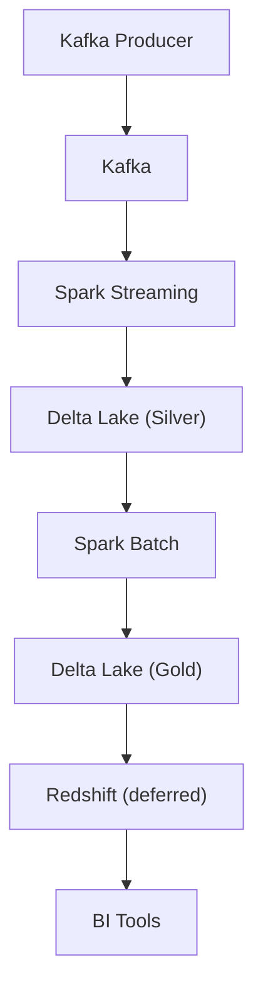
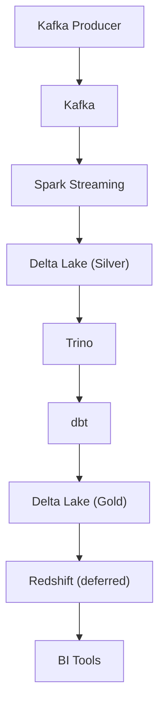
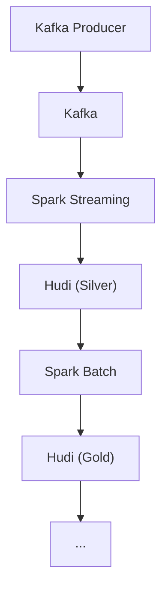
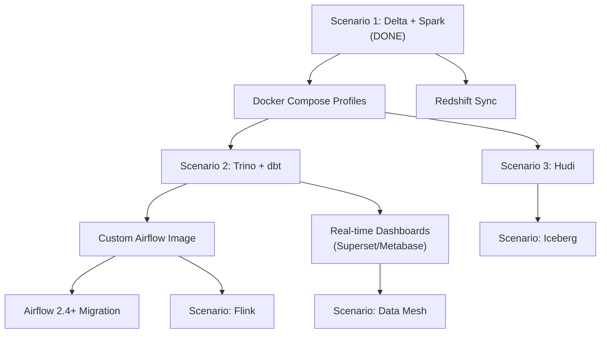

# Roadmap: Data Architecture Playground

## Vision

This project aims to become a **Data Architecture Playground and Laboratory** where students can explore, compare, and compose different Modern Data Architecture patterns using real, running infrastructure -- all locally with Docker.

Rather than learning about data architectures in theory, students will be able to:

- **Start any architecture scenario** with a single command
- **Compare approaches** side-by-side (e.g., Delta Lake vs Hudi, Spark vs Trino)
- **Swap components** to understand trade-offs (e.g., switch the compute engine, change the storage format)
- **Create custom compositions** by mixing and matching components

---

## Current State

**Implemented: Scenario 1 (Delta Lake + Spark) -- minus Redshift sync**

```
Producer -> Kafka -> Spark Streaming -> Delta Lake Silver (S3) -> Spark Batch -> Delta Lake Gold (S3)
```

The pipeline runs end-to-end locally with Docker Compose using **Architecture A (Streaming-First)**: the streaming job runs as a continuous Docker container, independent of Airflow. Airflow provides a demo pipeline DAG and a health-monitoring DAG, but does not orchestrate the real streaming pipeline.

See [architecture-guide.md](architecture-guide.md) for all orchestration patterns (streaming-first, Airflow-orchestrated, hybrid, event-driven) and how to configure them.

---

## Deferred Items

Items not covered by the current implementation, organized by category.

### Summary


| Item                            | Category       | Blocked By                                                      | Effort |
| ------------------------------- | -------------- | --------------------------------------------------------------- | ------ |
| Redshift sync                   | Scenario 1     | No JDBC driver in Spark image                                   | Medium |
| Delta table compaction (ZORDER) | Scenario 1     | OSS Delta Lake limitation                                       | Low    |
| Trino catalog configuration     | Scenario 2     | Deleted `hive.properties`, no Delta connector                   | Medium |
| Spark Thrift Server             | Scenario 2     | Not deployed as Docker service                                  | Medium |
| dbt integration                 | Scenario 2     | Thrift Server missing, `profiles.yml` broken, dbt not installed | High   |
| Hudi storage format             | Scenario 3     | Code commented out, Hudi JARs not configured                    | Medium |
| Docker Compose profiles         | Infrastructure | Not implemented                                                 | Medium |
| Custom Airflow image            | Infrastructure | Requires Java 17 + Spark in image                               | High   |
| Airflow-orchestrated Spark      | Infrastructure | Requires custom Airflow image                                   | High   |
| Airflow 2.4+ migration          | Infrastructure | Depends on custom Airflow image                                 | Medium |


### Redshift Sync

**Category:** Scenario 1 completion
**Current state:** `sync_to_redshift()` in `src/batch/batch_job.py` is wrapped in a conditional and skipped when `REDSHIFT_URL` is not configured.
**What's needed:**

- Add PostgreSQL JDBC JAR to Spark packages
- Configure LocalStack Redshift endpoint properly
- Verify JDBC connectivity from Spark to LocalStack Redshift
- Test write from Gold layer to Redshift tables
**Reference:** The `.env` file already has Redshift connection variables defined.

### Delta Table Compaction (ZORDER)

**Category:** Scenario 1 optimization
**Current state:** `compact_delta_tables()` in `src/batch/batch_job.py` uses `OPTIMIZE ... ZORDER BY` which is a Databricks-only feature not available in OSS Delta Lake. The call is skipped.
**What's needed:**

- Replace ZORDER with plain `OPTIMIZE` (supported in Delta Lake 3.x OSS)
- Or remove ZORDER and rely on `VACUUM` only for storage management
- Consider adding partition-level compaction strategies

### Trino Catalog Configuration

**Category:** Scenario 2 enablement
**Current state:** Trino starts via Docker Compose (port 8082) but has no catalogs. The original `config/trino/catalog/hive.properties` was deleted from git.
**What's needed:**

- Create `config/trino/catalog/delta.properties` with Delta Lake connector configuration
- Configure S3A endpoint, credentials, and path-style access for LocalStack
- Test querying Delta Lake Silver and Gold tables via Trino CLI or UI
**Reference:** Trino config is mounted from `./config/trino` to `/etc/trino`.

### Spark Thrift Server

**Category:** Scenario 2 enablement
**Current state:** Not deployed. Required by dbt-spark for thrift connection method.
**What's needed:**

- Add `spark-thrift` service to `docker-compose.yml`
- Configure with Delta Lake extensions and S3A access
- Add healthcheck on port 10000
- Expose port 10000 for dbt and external tools

<details>
<summary>Reference docker-compose spec</summary>

```yaml
spark-thrift:
  image: spark:3.5.3-scala2.12-java17-python3-ubuntu
  command: >
    /opt/spark/sbin/start-thriftserver.sh
    --master spark://spark-master:7077
    --hiveconf hive.server2.thrift.port=10000
    --conf spark.sql.extensions=io.delta.sql.DeltaSparkSessionExtension
    --conf spark.sql.catalog.spark_catalog=org.apache.spark.sql.delta.catalog.DeltaCatalog
    --conf spark.hadoop.fs.s3a.endpoint=http://localstack:4566
    --conf spark.hadoop.fs.s3a.access.key=test
    --conf spark.hadoop.fs.s3a.secret.key=test
    --conf spark.hadoop.fs.s3a.path.style.access=true
    --packages io.delta:delta-spark_2.12:3.2.0,org.apache.hadoop:hadoop-aws:3.3.4,com.amazonaws:aws-java-sdk-bundle:1.12.262
  ports:
    - "10000:10000"
  environment:
    - SPARK_NO_DAEMONIZE=true
  depends_on:
    - spark-master
  healthcheck:
    test: ["CMD-SHELL", "nc -z localhost 10000"]
    interval: 10s
    timeout: 5s
    retries: 10
    start_period: 60s
```

</details>

### dbt Integration

**Category:** Scenario 2 completion
**Current state:** dbt directory exists with models and tests but: `profiles.yml` has duplicate YAML keys, `sources.yml` is missing, test files contain multiple queries, and dbt-spark is not installed anywhere.
**What's needed:**

- Fix `dbt/profiles.yml` (remove duplicate keys, use env vars for Spark Thrift connection)
- Create `dbt/models/staging/sources.yml`
- Split multi-query test files into individual test files
- Ensure dbt-spark is available (either in custom Airflow image or a dedicated dbt container)
- Test `dbt run` and `dbt test` against Spark Thrift Server
**Depends on:** Spark Thrift Server

### Hudi Storage Format

**Category:** Scenario 3 enablement
**Current state:** Hudi writeStream code is commented out in `src/streaming/streaming_job.py`. The producer and Kafka infrastructure are shared and already working.
**What's needed:**

- Uncomment Hudi writeStream configuration in `streaming_job.py`
- Add Hudi Maven packages (`hudi-spark3.5-bundle_2.12`) to `spark.jars.packages`
- Create a separate S3 bucket for Hudi data (or use a path prefix)
- Adjust batch job to read from Hudi tables
- Test Hudi timeline and compaction features

### Docker Compose Profiles

**Category:** Infrastructure
**Current state:** All services start together with `docker compose up -d`. No way to selectively enable architecture scenarios.
**What's needed:**

- Define profiles: `core` (Kafka, Spark, S3, Airflow), `scenario-1` (Delta + Spark), `scenario-2` (Delta + Trino + dbt), `scenario-3` (Hudi)
- Assign services to profiles (e.g., `spark-thrift` only in `scenario-2`)
- Document profile usage: `docker compose --profile scenario-1 up -d`
- Ensure shared infrastructure (Kafka, Spark cluster, S3) is in `core` profile

### Custom Airflow Image

**Category:** Infrastructure
**Current state:** Using vanilla `apache/airflow:2.3.0`. DAGs use PythonOperator workaround because Airflow cannot run spark-submit or kafka-python.
**What's needed:**

- Build custom Dockerfile based on `apache/airflow:2.3.0-python3.8` (Python 3.8 required for dbt-spark)
- Install Java 17 (must match Spark cluster), wget, netcat
- Download and install Spark binaries for `spark-submit`
- Install Python packages: kafka-python, faker, dbt-spark, python-dotenv
**Depends on:** This is a prerequisite for Airflow-orchestrated Spark and dbt

<details>
<summary>Reference Dockerfile (docker/airflow/Dockerfile)</summary>

```dockerfile
FROM apache/airflow:2.3.0-python3.8

USER root

# Java 17 must match Spark cluster (java17-ubuntu image)
RUN apt-get update \
    && apt-get install -y --no-install-recommends \
       openjdk-17-jdk-headless \
       wget \
       netcat-openbsd \
    && rm -rf /var/lib/apt/lists/*

ENV JAVA_HOME=/usr/lib/jvm/java-17-openjdk-amd64
ENV PATH="${JAVA_HOME}/bin:${PATH}"

# Spark binaries — version must match cluster
ENV SPARK_VERSION=3.5.3
ENV HADOOP_VERSION=3
RUN wget -q https://archive.apache.org/dist/spark/spark-${SPARK_VERSION}/spark-${SPARK_VERSION}-bin-hadoop${HADOOP_VERSION}.tgz \
    && tar -xzf spark-${SPARK_VERSION}-bin-hadoop${HADOOP_VERSION}.tgz -C /opt \
    && mv /opt/spark-${SPARK_VERSION}-bin-hadoop${HADOOP_VERSION} /opt/spark \
    && rm spark-${SPARK_VERSION}-bin-hadoop${HADOOP_VERSION}.tgz

ENV SPARK_HOME=/opt/spark
ENV PATH="${SPARK_HOME}/bin:${PATH}"

USER airflow

COPY requirements-airflow.txt /tmp/
RUN pip install --no-cache-dir -r /tmp/requirements-airflow.txt
```

</details>

<details>
<summary>Reference requirements (docker/airflow/requirements-airflow.txt)</summary>

```
kafka-python
confluent-kafka
faker
dbt-core==1.4.0
dbt-spark[PyHive]==1.4.0
apache-airflow-providers-apache-spark
python-dotenv
```

</details>

### Airflow-Orchestrated Spark (Architecture B DAGs)

**Category:** Infrastructure
**Current state:** Streaming runs as a Docker container. Airflow only provides a demo DAG and health monitoring.
**What's needed:**

- Build the custom Airflow image (see above)
- Create `dags/clickstream_streaming_dag.py` — checks Spark Master API for running streaming app, submits via `spark-submit --deploy-mode cluster --supervise` if not running, runs every minute with `max_active_runs=1`
- Create `dags/clickstream_processing_dag.py` — daily batch DAG that runs producer (60s), spark-submit batch job, and dbt tests in sequence
- Configure Airflow Spark connection: `AIRFLOW_CONN_SPARK_DEFAULT=spark://spark-master:7077`
**Depends on:** Custom Airflow image, Spark Thrift Server (for dbt tasks)

<details>
<summary>Key pattern: streaming DAG with ShortCircuitOperator</summary>

```python
from airflow.operators.python import ShortCircuitOperator

def is_streaming_job_needed():
    """Check Spark Master REST API for running streaming app."""
    result = subprocess.run(
        ["curl", "-s", "http://spark-master:8080/json/"],
        capture_output=True, text=True, timeout=10
    )
    data = json.loads(result.stdout)
    for app in data.get("activeapps", []):
        if "streaming" in app.get("name", "").lower():
            return False  # already running
    return True  # needs submission

check_job = ShortCircuitOperator(
    task_id='check_if_submission_needed',
    python_callable=is_streaming_job_needed,
)
```

</details>

### Airflow 2.4+ Migration

**Category:** Infrastructure
**Current state:** Running Airflow 2.3.0. Streaming job orchestration uses a separate docker-compose service.
**What's needed:**

- Upgrade to Airflow 2.4.3 for `@continuous` scheduling support
- Run `airflow db migrate` on upgrade
- Replace streaming job docker-compose service with Airflow-orchestrated `@continuous` DAG
- Full spec in [airflow-migration-plan.md](airflow-migration-plan.md)
**Depends on:** Custom Airflow image, Spark Thrift Server (for dbt DAGs)

---

## Architecture Scenario Roadmap

### Scenario 1: Delta Lake + Spark (Current)




**Status:** Working (minus Redshift sync)


| Milestone                                                  | Status   | Description                                         |
| ---------------------------------------------------------- | -------- | --------------------------------------------------- |
| Core pipeline (Producer -> Kafka -> Spark -> Delta Silver) | Done     | Events flowing end-to-end                           |
| Batch aggregation (Silver -> Gold)                         | Done     | On-demand via `docker compose exec`                 |
| Redshift sync (Gold -> Redshift)                           | Deferred | Needs JDBC driver and LocalStack Redshift config    |
| BI Tools integration                                       | Future   | Depends on Redshift; could add Metabase or Superset |


### Scenario 2: Delta Lake + Trino + dbt




**Status:** Not started -- Trino starts but has no catalog; dbt not configured


| Milestone                    | Status      | Description                                                |
| ---------------------------- | ----------- | ---------------------------------------------------------- |
| Trino catalog for Delta Lake | Not started | Create `delta.properties` with S3A/Delta connector         |
| Spark Thrift Server          | Not started | Deploy as Docker service for dbt connection                |
| dbt models and tests         | Not started | Fix `profiles.yml`, install dbt-spark                      |
| dbt-driven Gold layer        | Not started | Use dbt to transform Silver -> Gold instead of Spark batch |
| Redshift sync                | Not started | Same as Scenario 1                                         |


### Scenario 3: Hudi instead of Delta Lake




**Status:** Not started -- code is commented out


| Milestone                | Status      | Description                                                    |
| ------------------------ | ----------- | -------------------------------------------------------------- |
| Hudi streaming write     | Not started | Uncomment and configure Hudi writeStream in `streaming_job.py` |
| Hudi Maven packages      | Not started | Add `hudi-spark3.5-bundle_2.12` to packages                    |
| Hudi batch aggregation   | Not started | Adapt batch job to read/write Hudi tables                      |
| Hudi timeline management | Not started | Configure compaction strategy, explore timeline API            |


### Orchestration Architectures

In addition to storage format scenarios, the project supports different **orchestration patterns** (see [architecture-guide.md](architecture-guide.md) for full details):

| Architecture | Description | Status |
| --- | --- | --- |
| **A: Streaming-First** | Streaming runs as Docker containers, Airflow monitors only | **Working** |
| **B: Airflow-Orchestrated** | Airflow submits and manages all jobs via spark-submit | Deferred (needs custom Airflow image) |
| **C: Hybrid** | Streaming runs independently, Airflow orchestrates batch layer | Partially implemented |
| **D: Event-Driven** | Airflow KafkaSensor triggers processing on data arrival | Deferred (needs kafka provider) |

### Future Scenarios (Ideas)

These are additional architecture patterns that could be added to expand the playground:


| Scenario                         | Description                                               | New Components                                              |
| -------------------------------- | --------------------------------------------------------- | ----------------------------------------------------------- |
| **Iceberg**                      | Apache Iceberg as an alternative lakehouse format         | Iceberg Spark runtime, Iceberg catalog                      |
| **Flink instead of Spark**       | Replace Spark Streaming with Apache Flink                 | Flink JobManager, TaskManager, Flink SQL                    |
| **Debezium CDC**                 | Change Data Capture from a relational database            | Debezium, Kafka Connect, source database (MySQL/Postgres)   |
| **Real-time dashboards**         | Live dashboards on streaming data                         | Apache Superset or Metabase, connected to Trino             |
| **Data mesh**                    | Multiple domain-specific pipelines sharing infrastructure | Multiple producers, domain-specific schemas, data contracts |
| **Lakehouse with Unity Catalog** | Centralized governance and catalog                        | Unity Catalog (OSS), or Polaris catalog                     |
| **Stream processing patterns**   | Windowing, joins, late data handling                      | Enhanced streaming jobs, watermarking                       |
| **Data quality framework**       | Great Expectations or Soda for data validation            | Great Expectations container, quality reports UI            |
| **ML feature store**             | Feature engineering pipeline feeding an ML store          | Feast, feature tables in Gold layer                         |
| **Multi-cloud simulation**       | MinIO instead of LocalStack for S3                        | MinIO, multi-region replication                             |


---

## Implementation Priority

Recommended order for expanding the playground beyond the current state:




The recommended approach is:

1. **Docker Compose Profiles** first -- enables selective architecture startup
2. **Scenario 2 (Trino + dbt)** -- most requested by data engineering students
3. **Custom Airflow Image** -- unlocks Airflow-orchestrated Spark jobs
4. **Scenario 3 (Hudi)** -- introduces lakehouse format comparison
5. **Future scenarios** -- based on student interest and course curriculum

